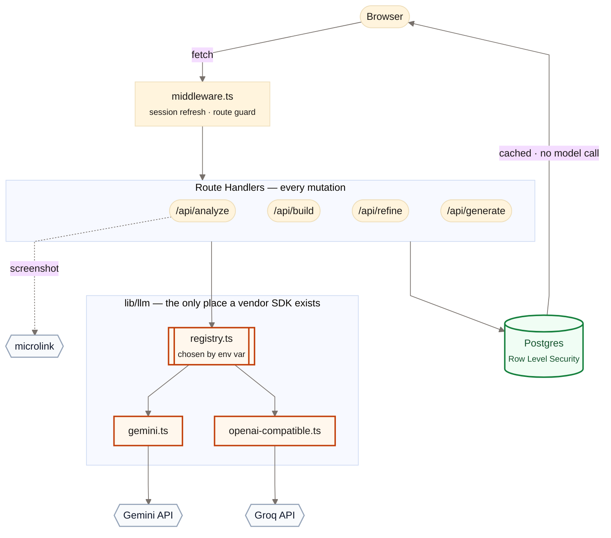
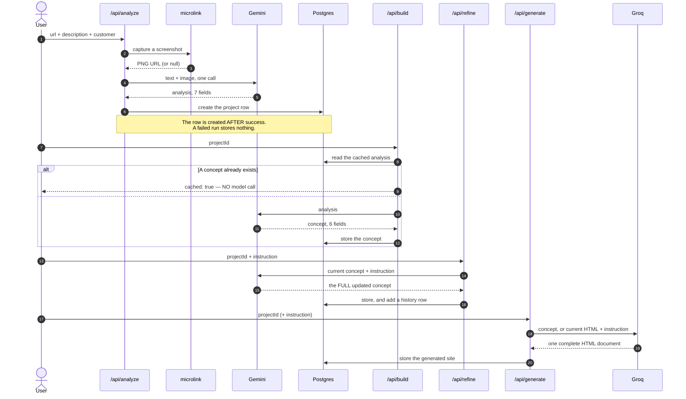
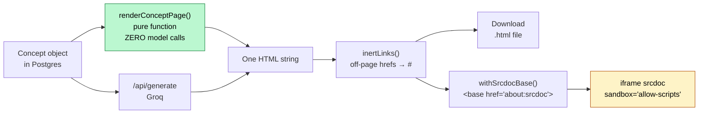
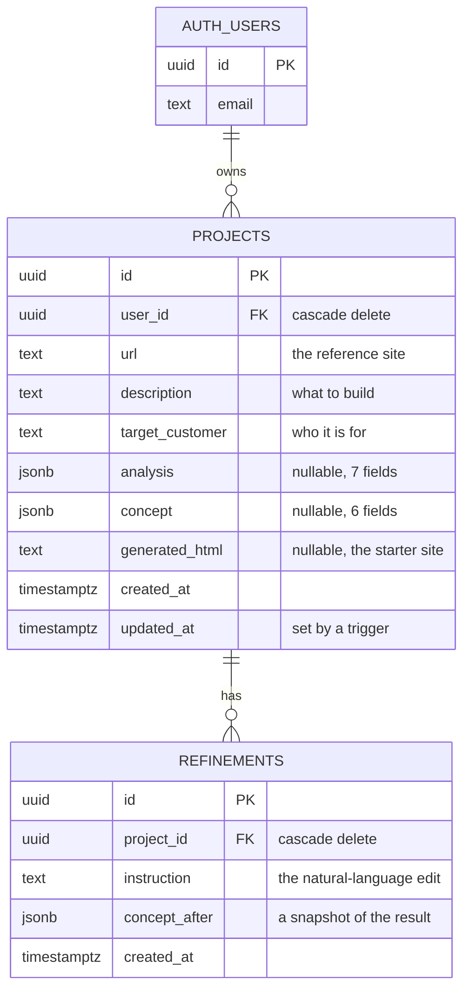
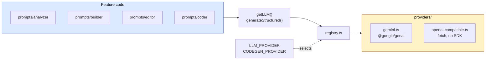
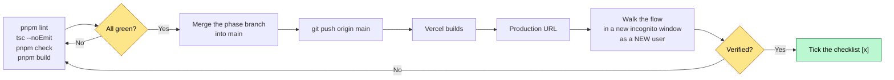
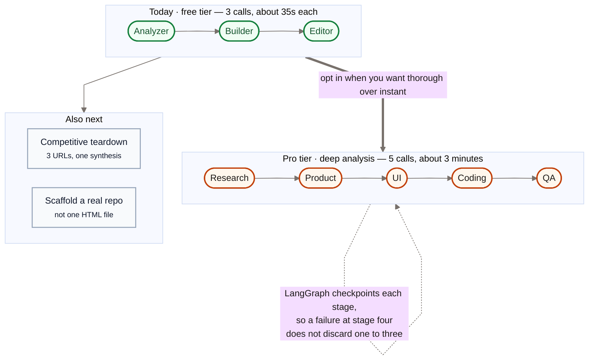

# Reforge

Point Reforge at any product's website. It reads what the product does, who it
serves and where it is weak. It then generates your own product concept, which
you change in plain English.

**Live:** **https://reforge.rounak.co** · fallback: https://reforge-blond-two.vercel.app/

## Demo video

<!-- PLACEHOLDER — replace YOUTUBE_ID in BOTH links below with the real id
     after upload. The thumbnail URL and the watch URL must carry the same id. -->

[](https://www.youtube.com/watch?v=YOUTUBE_ID)

*Click to play. Approximately 3 minutes: what it is, a live teardown, the
concept, a plain-English refinement, the generated starter site, and the
architecture.*

<details>
<summary>Embedded player, for renderers that permit HTML</summary>

<!-- GitHub removes iframes from README files, thus the thumbnail above is the
     link that works there. This block renders on a documentation site or in a
     local markdown preview. -->

<iframe
  width="720"
  height="405"
  src="https://www.youtube.com/embed/YOUTUBE_ID"
  title="Reforge — 3 minute demo"
  frameborder="0"
  allow="accelerometer; autoplay; clipboard-write; encrypted-media; gyroscope; picture-in-picture"
  allowfullscreen>
</iframe>

</details>

This document is written in ASD-STE100 Simplified Technical English.

---

## Try it without an account

One account holds a finished project. Use it to see the output without spending
the shared free-tier AI quota.

| | |
|---|---|
| **Email** | `demo@reforge.app` |
| **Password** | `reforge-demo-2026` |

It opens **"Soloist"**, an issue tracker for one developer, built from a
`linear.app` teardown. It holds all seven analysis fields, all six concept
fields, two refinements and a generated starter site.

The project includes a `/pricing` page on purpose. Type *"Remove the pricing
page."* into the refine box to see a real edit.

These credentials are public on purpose. To restore the account, run
`pnpm seed:demo`. That command makes **zero model calls**.

---

## Contents

1. [Architecture](#architecture)
2. [Tech stack](#tech-stack)
3. [Setup instructions](#setup-instructions)
4. [Environment variables](#environment-variables)
5. [APIs used](#apis-used)
6. [Database structure](#database-structure)
7. [AI models used](#ai-models-used)
8. [Deployment process](#deployment-process)
9. [Known limitations](#known-limitations)

Process documentation is in [`docs/`](docs/). The working material that built
the project is in [`internal/`](internal/).

---

## Architecture

Reforge is one Next.js App Router project on Vercel. The interface renders in
Server Components where possible. Interactive parts are Client Components.

**Each data change goes through a Route Handler under `app/api/*`, called from
the client.** There is one pattern. There are no Server Actions.



Two boundaries are enforced by the build, not only intended:

- **The model API key never reaches the browser.** Each model call is
  server-side.
- **The service-role Supabase client cannot reach a Client Component.**
  `lib/supabase/admin.ts` starts with `import "server-only"`. Such an import is
  a build error, not a silent key leak.

### The AI pipeline

Four server-side calls. Each returns strict JSON that zod parses into a typed
object.



The editor returns the complete concept object, not a patch. This makes it
idempotent, simple to store, and it makes undo a restore of the previous row.

Each result is cached in Postgres. **To reopen a saved project renders from the
database and never calls a model again.** This is both a cost rule and a product
requirement.

### The preview frame

The concept renders as a real web page in two ways. Both produce **one HTML
string**, thus the frame, the download and the database all hold the same
object.



Two guards are load-bearing. Do not remove them:

- `sandbox="allow-scripts"` **without** `allow-same-origin` gives the document
  an opaque origin. Script inside cannot read the application cookies or the
  Supabase session. To add `allow-same-origin` cancels both flags.
- `withSrcdocBase` is frame-only. A srcdoc document inherits the base URL of its
  parent, thus a link goes to the application and not to the page. Entry 12 of
  the debugging log gives the measurements.

### Directory shape

```
app/
  (marketing)/           public landing page
  (auth)/                login, signup
  (app)/dashboard/       protected
  api/                   analyze · build · refine · generate · auth/*
lib/
  env.ts                 zod-validated environment access
  safe-redirect.ts       same-origin guard for `next` parameters
  llm/                   provider layer — the only place a vendor SDK appears
  prompts/               analyzer · builder · editor · coder
  preview/               render-concept · inert-links
  supabase/              browser · server · middleware · admin
components/
supabase/migrations/     schema
scripts/                 seed-demo
docs/                    the four required process documents
internal/                the brief, the guidelines, the working notes
```

---

## Tech stack

| Layer | Choice | Reason |
|---|---|---|
| Framework | Next.js 15.5.23 (App Router), React 19.1.0 | One deployment target for the interface and the API |
| Language | TypeScript strict, with `noUncheckedIndexedAccess` | The pipeline indexes into arrays that come from model output |
| Styling | Tailwind v4, shadcn/ui on Radix | A product-quality interface in hours |
| Backend | Next.js Route Handlers | One change pattern everywhere |
| Database | Supabase Postgres, RLS on | The same service as the authentication |
| Authentication | Supabase Auth, email and password | One SDK for both |
| Runtime LLM | `gemini-3.1-flash-lite`, free tier | Zero recurring cost. See *AI models used* |
| Code generation | `openai/gpt-oss-120b` on Groq, free tier | A separate quota, thus it cannot exhaust Gemini |
| Hosting | Vercel Hobby | Free. It deploys on each push to `main` |

**Zero recurring cost is a hard requirement.** Claude Code built the
application. Gemini and Groq run inside it. No paid API is called at runtime.

---

## Setup instructions

You need Node 22 or later, and pnpm.

```bash
git clone git@github.com:Rounak7721/ReForge.git
cd ReForge
pnpm install

cp .env.example .env       # then fill in the values, see below
pnpm dev                   # http://localhost:3000
```

Run these checks before each commit and each deployment:

```bash
pnpm lint          # must pass
npx tsc --noEmit   # must pass
pnpm check         # four self-checks, must pass
pnpm build         # must pass
```

There is no test framework. Verification is these four commands, a walk through
the flows in a browser, and direct SQL assertions against the RLS policies.

`pnpm check` runs five assert-based self-checks. Each one protects logic that
has already broken production one time:

| Check | What it protects |
|---|---|
| `render-concept.check.ts` | Escaping, the hex guard, alpha values, typeface parsing |
| `inert-links.check.ts` | Link neutralisation and the srcdoc base tag |
| `openai-compatible.check.ts` | Schema translation for the OpenAI wire format |
| `gemini.check.ts` | The schema sanitiser that keeps `/api/build` working |
| `rate-limit.check.ts` | The per-account caps, and that a counting failure fails open |

### Run it with Docker

The repository ships a `Dockerfile`, a `compose.yaml` and a `Makefile`.

```bash
make env            # creates .env from .env.example
# fill in .env, then:
make docker-up      # builds, starts, and waits for the healthcheck
```

The application is then on `http://localhost:3000`. `make docker-logs` follows
the logs, and `make docker-down` stops it.

**There is no database in the image and none in compose.** The application uses
a hosted Supabase project for Postgres and authentication, and hosted APIs for
the models. Bring your own Supabase project and put its keys in `.env`. To run
the datastore locally as well, use `supabase start` from the Supabase CLI, which
starts the full stack correctly. This repository does not try to reproduce it.

The image is 322 MB. It runs as the unprivileged `node` user, on a read-only
root filesystem with `no-new-privileges`, and it holds only the standalone
server, the static assets and `public/`.

#### One rule to remember

`NEXT_PUBLIC_SUPABASE_URL` and `NEXT_PUBLIC_SUPABASE_ANON_KEY` are **build-time**
values. Next.js compiles them to literal strings, and `lib/env.ts` validates
them when the module loads.

| You changed | You need |
|---|---|
| `NEXT_PUBLIC_*` | `make docker-build` |
| Any other variable | `make docker-restart` |

Compose reads `.env` for both jobs, thus you keep one file. If a public variable
is empty, compose stops immediately and names it, instead of failing at the end
of a long build.

### Make targets

`make` on its own lists every target.

| Target | Action |
|---|---|
| `make verify` | lint, then types, then the self-checks, then the build |
| `make dev` | The development server |
| `make seed` | Reset the demo account. Zero model calls |
| `make docker-up` | Build, start, and wait for the healthcheck |
| `make docker-restart` | Restart after a server-only variable change |
| `make docker-logs` | Follow the logs |
| `make nuke` | Remove build output, `node_modules` and the image |

### Database setup

The migrations are in `supabase/migrations/`. Apply them in filename order. To
build the schema on a new Supabase project, run the contents of each file in the
SQL editor. Each statement can run more than one time, thus a replay is safe.

One project setting is not in the migrations. **Email confirmation must be
off.** Go to Authentication, then Sign In / Providers, then Email, and turn
*Confirm email* off. See *Known limitations* for the reason.

---

## Environment variables

Secrets exist only in `.env`, which Git ignores, and in the Vercel environment
variables. `.env.example` stays current with each new variable.

`lib/env.ts` validates these with zod when the module loads. A missing variable
fails with a named error. It does not arrive as `undefined` inside a client
constructor.

### Model providers

Only the **active** provider needs a key. The others can stay empty.

| Variable | Purpose |
|---|---|
| `LLM_PROVIDER` | `gemini` \| `openai` \| `groq`. Selects the provider in `lib/llm`. |
| `GEMINI_API_KEY` | Google AI Studio key. Server-only. |
| `GEMINI_MODEL` | `gemini-3.1-flash-lite` |
| `GROQ_API_KEY` | Groq key, for code generation. |
| `GROQ_MODEL` | `openai/gpt-oss-120b` |
| `OPENAI_API_KEY` | Optional. Present to prove that the layer is vendor-neutral. |
| `OPENAI_MODEL` | `gpt-4o-mini` |
| `CODEGEN_PROVIDER` | Which provider generates code. Empty falls back to `LLM_PROVIDER`. |

`CODEGEN_PROVIDER` falls back on purpose. **Groq must never become
load-bearing.** If its free tier changes, code generation moves to Gemini and
continues to work.

### Supabase

| Variable | Purpose |
|---|---|
| `NEXT_PUBLIC_SUPABASE_URL` | Project URL |
| `NEXT_PUBLIC_SUPABASE_ANON_KEY` | Publishable key. Public by design. RLS limits it. |
| `SUPABASE_SERVICE_ROLE_KEY` | **This key ignores RLS.** Server-only. Never add a `NEXT_PUBLIC_` prefix. |

### Screenshots

| Variable | Purpose |
|---|---|
| `MICROLINK_API_KEY` | Optional. The code uses the anonymous tier, which needs no key. A key raises the rate limit. |

---

## APIs used

| API | Purpose | Tier |
|---|---|---|
| **Google Gemini** | Analyzer, builder and editor calls | Free |
| **Groq** | Code generation and code edits | Free |
| **Supabase** — Postgres, Auth, Management | Database, authentication, configuration | Free |
| **microlink.io** | Website screenshots for the vision feature | Free, anonymous tier |

### Our own routes

| Route | Method | Behaviour |
|---|---|---|
| `/api/auth/signup` | POST | Returns `{ signedIn }`. |
| `/api/auth/login` | POST | Signs the user in. |
| `/api/auth/logout` | POST | Signs the user out. |
| `/api/analyze` | POST | url, description and customer give a 7-field analysis. It creates the project row **after** the analysis succeeds, thus a failed run stores nothing. |
| `/api/build` | POST | projectId gives a 6-field concept from the cached analysis. It returns `cached: true` and calls no model when a concept exists. |
| `/api/refine` | POST | projectId and an instruction give the **full** updated concept, and one history row. |
| `/api/generate` | POST | projectId gives one complete HTML document. With an instruction, it edits the current document. |

Each route validates its input with zod, holds the call in a try/catch, and
returns a typed envelope with a real status code:

```ts
{ error: { code: ApiErrorCode, message: string } }
```

The interface branches on `code`. It shows `message`. To keep them separate lets
a rate-limited state render differently from a general failure, with no match on
message text.

---

## Database structure

Two tables. RLS is on for both.



`projects` is indexed on `(user_id, created_at desc)`.

The JSON columns can be null, because a project exists from creation, before
either model call runs. Zod enforces their shape at the application boundary.
Postgres does not.

`refinements` is append-only by design. There is no UPDATE policy.
`concept_after` makes undo a restore of the previous row, and it gives the
interface a real history to show.

### Row Level Security

There are seven policies, one for each command, instead of one blanket
`for all`. Thus the intent of each policy is explicit, and a wide `USING` clause
cannot open a write path without notice.

`projects` compares `user_id` directly. `refinements` proves ownership through
its parent project.

**RLS enforces ownership. The middleware is only for the user experience.**

Verified directly against Postgres with `set local role authenticated` and JWT
claims, for reads **and** writes:

| Attempt by user A against the data of user B | Result |
|---|---|
| Read the projects of B | 0 rows |
| Update a project of B | 0 rows matched |
| Delete a project of B | 0 rows matched |
| Insert a project owned by B | Policy violation |
| Attach a refinement to a project of B | Policy violation |

---

## AI models used

### Runtime

| Use | Model | Tier |
|---|---|---|
| Analyze, build, refine | `gemini-3.1-flash-lite` | Free |
| Generate and edit code | `openai/gpt-oss-120b` on Groq | Free |

Each call goes through `lib/llm`. Feature code imports only `getLLM` and
`generateStructured`. No vendor SDK appears outside `lib/llm/providers/*`.



To change the model or the vendor is an environment change. It needs no edit to
the analyzer, the builder, the editor or the coder. To add a vendor is one new
file in `providers/` and one line in `registry.ts`.

Groq speaks the OpenAI wire format, thus one file serves both vendors. That file
uses `fetch` and not the `openai` SDK. A new dependency with an install script
has broken this repository two times. Entry 4 of the debugging log gives the
detail.

### Development

**Claude Code (Opus 5)** wrote the application. Gemini and Groq run inside the
product. No Anthropic API is called at runtime. See
[`docs/02-ai-tools-and-workflow.md`](docs/02-ai-tools-and-workflow.md).

### Why flash-lite, and not a Flash model

The team verified the model ID against the live API. It did not use memory. Two
assumptions were wrong. `gemini-2.5-flash` returns **404, "no longer available
to new users"**. `gemini-3.7-flash` returns `UNAVAILABLE` under load, and
`gemini-flash-latest` points to it. Thus the project avoids each `*-latest`
alias.

The deciding measurement is **requests each day**, which is much tighter than
requests each minute. One complete demonstration of the graded flow is 6 calls.

| Model | RPM | Requests each day | Complete demonstrations each day |
|---|---|---|---|
| `gemini-3.6-flash` | 5 | 20 | 3 |
| `gemini-3.5-flash` | 5 | 20 | 3 |
| **`gemini-3.1-flash-lite`** | **15** | **500** | **83** |

Quality was checked on a real analyzer workload with real marketing copy through
the full 7-field schema. Each field was populated, the content was sensible, and
the call took approximately 2 seconds.

### Three measured traps that the provider layer handles

1. **`maxOutputTokens` limits thinking and output together.** With a small
   budget the model spends it all on reasoning and returns HTTP 200 with
   `content: {}` and no `parts` array. Thus
   `candidates[0].content.parts[0].text` **throws** instead of returning
   `undefined`.
2. **`thinkingLevel` is not portable.** flash-lite emits 0 thinking tokens with
   no configuration, and 118 with `thinkingLevel: "low"`. That is the opposite
   of `3.6-flash`. The layer enforces a token floor. It does not trust the
   parameter.
3. **Gemini rejects `minItems` and `maxItems` when the schema also holds an
   `enum`.** This stopped `/api/build` and `/api/refine` in production with no
   deployment. The sanitiser removes the two keywords, and zod still enforces
   the bounds on the response.

Entries 2, 9 and 10 of the debugging log give full reproduction steps.

---

## Deployment process

GitHub connects to Vercel. **Each push to `main` deploys automatically.** There
is no manual `vercel` command in the normal loop.



Work happens on phase branches such as `phase-1/db-auth` and fast-forwards into
`main`. Thus the commit history stays linear and easy to read.

An environment variable must exist in Vercel **before** the deployment that
first reads it. A missing variable builds correctly and then fails at runtime.

### Domain

The production domain is **`reforge.rounak.co`**, live since 2026-08-27.

`rounak.co` uses Cloudflare nameservers. The `reforge` record is a CNAME to the
target that Vercel issued, set to **DNS-only** — the grey cloud, not the orange
one. Cloudflare must not proxy this record: the orange cloud blocks the
certificate that Vercel issues, and it needs SSL/TLS mode Full (strict) even
after that. Vercel terminates TLS with a Let's Encrypt certificate.

The generated `*.vercel.app` URL serves the same deployment, thus it stays
usable as a fallback.

Both hostnames must be present in the Supabase Auth redirect allow-list.
Otherwise a sign-in that starts on one hostname fails on the other.

---

## Known limitations

- **The free-tier model quota is 15 requests each minute and 500 requests each
  day, shared by everybody who uses the deployment.** One full demonstration is
  exactly 6 calls, measured. This is why each result is cached in Postgres, and
  why to reopen a project never calls a model again. The seeded demo account is
  the insurance against an empty quota.
- **Groq allows 1000 requests each day but only 8000 tokens each minute.** The
  token bucket is the real limit. Groq also reserves the prompt tokens and the
  output limit **before** generation, thus a request that asks for more than the
  bucket holds fails immediately with a 413.
- **Rate limiting is per-account, counted from existing rows.** `/api/analyze`
  allows 3 an hour and 10 a day. `/api/refine` allows 10 an hour and 40 a day.
  The counts come from the `projects` and `refinements` tables, which are
  already timestamped and already scoped by row-level security, thus there is no
  counter table that can drift from reality. `/api/build` returns `cached: true`
  without a model call once a concept exists, and `/api/generate` runs on Groq
  behind its own per-minute limiter.

  **The ceiling:** these are per-account windows. Somebody willing to create many
  accounts is not stopped, and neither is a distributed attempt. What it stops is
  the realistic case — the demo credentials published in this README, in a loop
  — and it bounds one account to 50 Gemini calls a day, a tenth of the daily
  allowance. A counting failure fails **open**, and logs.

- **The SSRF guard resolves and then fetches. It does not pin the address.** It
  blocks private and loopback addresses in each encoding, and it validates each
  redirect step. But a hostname whose DNS answer changes between our lookup and
  the fetch is not caught. To close this needs a pinned-IP connection with a
  `Host` override, which `fetch` does not offer.
- **"Add a dashboard" is interpretive.** Measured on production: where no
  dashboard exists, the model changes the home page into one. It does not add a
  fifth page. This is consistent and defensible, but it is not additive. The
  builder also does not always emit a pricing page, thus two of the four example
  instructions in the brief can do nothing, depending on the draft.
- **Rate-limit handling must separate the minute limit from the day limit.** A
  daily limit does not clear on a retry, thus "rate limited, retrying" is
  dishonest after the 500th call.
- **Analysis reads text.** The analyzer gets the HTML and removes the markup. A
  site that renders only with JavaScript falls back to the meta tags and the
  title, and the interface says that the site was thin. A screenshot adds visual
  understanding, but only when microlink answers.
- **Email confirmation is off, on purpose.** With it on, each signup sends an
  email, and the built-in mailer of Supabase allows only a few each hour on the
  free tier. After that, signup fails for the whole project. The trade is that
  email addresses are not verified. Entry 3 of the debugging log gives the
  detail.
- **There is no server-rendered theme.** `next-themes` resolves light, dark and
  system on the client with a blocking inline script. The first paint is
  correct, but the server does not know the theme.
- **Export uses a print stylesheet, not a generated PDF.** "Download PDF" opens
  the print dialog of the browser on a paper-styled route. This avoids a PDF
  dependency and a rendering service. The exact output depends on the browser
  and the paper size.
- **The generated starter site is one page.** Navigation links are in-page
  fragments. A multi-page bundle needs a ZIP writer and a different preview,
  which the one-HTML-string design deliberately avoids.
- **There is no automated test suite.** Verification is lint, type check,
  `pnpm check`, a build, Playwright walkthroughs and direct SQL assertions
  against RLS.
- **The multi-agent workflow is deferred to a paid tier, not abandoned.** A
  Research, Product, UI, Coding and QA chain is five sequential model calls for
  one click. Build already takes about 35 seconds, thus the chain takes **two
  and a half to three minutes** — and iteration is the whole point of this
  product. A three-minute feedback loop is a worse product, not a deeper one.

  Reliability compounds the same way. One call has one zod validation and one
  stricter retry. Five chained calls give five failure points, where a failure
  at stage four discards the work of stages one to three unless each stage
  checkpoints separately.

  That combination — slower, costlier, more thorough — describes a **paid tier**
  rather than a default. Deep analysis is where a free plan converts: the user
  chooses thoroughness and accepts the wait, and the extra compute is paid for
  rather than absorbed.

  The design is not the blocker. Each agent is a node with typed state on the
  edges, and LangGraph supplies the orchestration, the retries and the
  checkpointing that make a partial failure recoverable instead of total.



---

## Documentation

### Required process documents — [`docs/`](docs/)

| Document | Content |
|---|---|
| [01 — AI Development Process](docs/01-ai-development-process.md) | How the project went from an empty folder to a deployed product |
| [02 — AI Tools and Workflow](docs/02-ai-tools-and-workflow.md) | Each Claude Code skill, MCP server and gate, and what was rejected |
| [03 — Prompt Log](docs/03-prompt-log.md) | Five human prompts, each with the four required answers |
| [04 — Debugging Log](docs/04-debugging-log.md) | Twelve real failures with the full Problem → Prompt → Attempt → Debug → Fix trail |

### Working material — [`internal/`](internal/)

The brief, the requirement checklists and the session notes that built the
project. Read [`internal/README.md`](internal/README.md) first.
