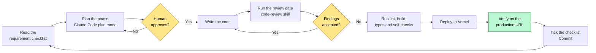
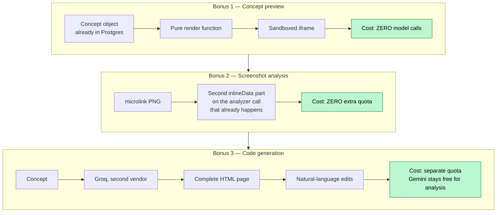
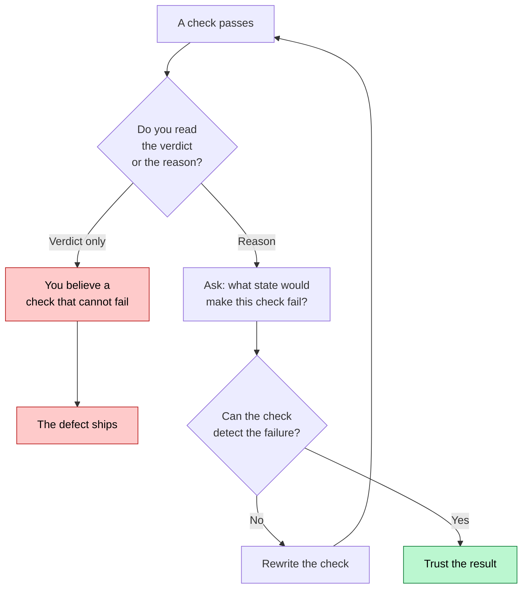
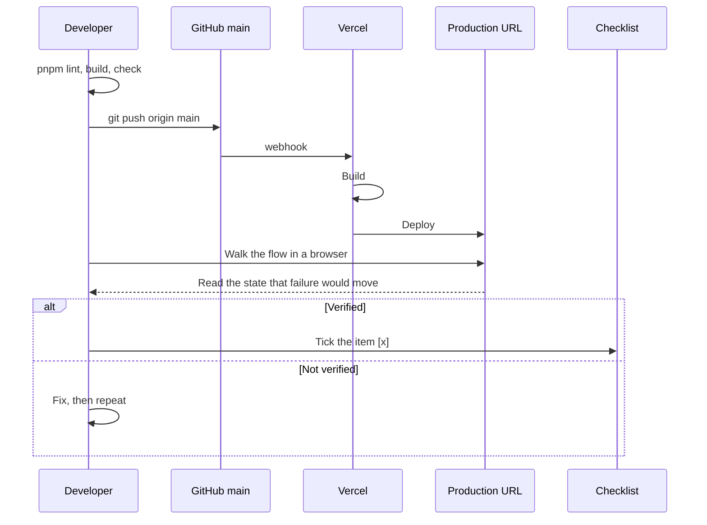

# AI Development Process

This document tells how Reforge went from an empty folder to a deployed
product. All times come from `git log`. The project has 38 commits in
approximately 27 working hours across three days.

Written in ASD-STE100 Simplified Technical English.

---

## 1. Summary

The work follows one loop for each phase. The loop does not change.



Two rules control this loop:

1. The AI does not write code from a plan that the human did not approve.
2. No item is ticked until a person sees it work on the deployed URL.

---

## 2. The first decision

The team did not start with code. The team first changed the assignment PDF
into nine checklist documents. These documents are in `internal/guidelines/`.

- `02-functional-requirements.md` gives the seven required areas as tickboxes.
- `07-scoring-map.md` maps the 100-point score onto specific actions.

After this step, nobody read the PDF again. The checklists became the source of
truth. The team checked each feature against the checklists before it built the
feature.

Each document marks the team's own choices with **[OUR DECISION]**. This mark
keeps "required" separate from "chosen". A requirement and a preference then
cannot be confused.

`CLAUDE.md` holds the working agreement. The agreement has four rules:

1. Plan before you build.
2. Do one phase at a time.
3. Run a review gate after each phase.
4. Ask before any action that you cannot reverse.

The agent reads `CLAUDE.md` on each turn. An agent that gets a rule one time
forgets the rule. An agent that reads the rule each turn obeys the rule.

---

## 3. The phases

```mermaid
timeline
    title Reforge build order
    section Day 1 - 25 Aug
        17:18 Phase 0 : Scaffold Next.js and shadcn : Probe the live model API : Pin the model on quota
        21:23 Phase 1 : Supabase schema : Row Level Security from migration 0001 : Auth conventions fixed
    section Day 2 - 26 Aug
        11:46 Phase 2-3 : Provider layer BEFORE the first model call : Analyzer, Builder, Editor
        13:55 Phase 5-6 : Landing page : Seeded demo account : Security hardening
        14:47 Redesign : AI UI audit : Dual-theme design system : Hand-authored logo
    section Day 3 - 27 Aug
        00:54 Bonus 1 : Concept preview, zero model calls
        01:20 Bonus 2 : Screenshot analysis, no extra quota
        02:04 Bonus 3 : Code generation on a second vendor
        12:00 Cleanup : Production verification : Documentation
```

### Phase 0 — Scaffold and constraints

The team ran `create-next-app` and `shadcn`. The team then pinned the model.

The team selected the model with measurements of the live API. The team did not
read marketing pages. Two commits one hour apart show the result:

| Commit message | Model | Requests each day |
|---|---|---|
| `pin gemini-3.6-flash after probing the live API` | `gemini-3.6-flash` | 20 |
| `switch runtime model to gemini-3.1-flash-lite on quota grounds` | `gemini-3.1-flash-lite` | 500 |

The first model gave better answers. The second model gave 500 requests each
day instead of 20. One complete demonstration uses six model calls. Thus 20
requests each day gives only three demonstrations, and the evaluator shares
that quota. Quota was more important than quality. Only measurement showed this
difference.

### Phase 1 — Data and authentication

The team wrote the Supabase schema with Row Level Security in migration 0001.
The team did not add security later.

The team fixed two authentication rules in this phase. The rules did not change
again:

- Always call `getUser()`. Never call `getSession()`.
- Map errors by `error.code`. Never match the text of an error message.

### Phases 2 and 3 — The AI pipeline

The team built the provider layer **before** the first model call. All model
access goes through `lib/llm`. Feature code imports `generateStructured`. No
feature file imports a vendor SDK.

This discipline gave a return on day three. The team added code generation on a
second vendor. The analyzer, the builder and the editor did not change.

The team selected the concept schema by measurement. The team made 42 live
calls. The calls compared three formats across four tasks:

| Format | Build | Narrow edit | Structural edit | Depth stress |
|---|---|---|---|---|
| Nested JSON | 100% | 100% | 100% | 100% |
| XML | 100% | 100% | 100% | 100% |
| Flat JSON | 100% | 100% | 100% | 100% |

All three formats scored 100%. The belief that deep nesting is a risk was
wrong. Nested JSON won on two smaller grounds. Entry 2 of the prompt log gives
the full result.

One schema decision is not obvious. **Array minimums are 1, not 3.**

The editor shares this schema. "Remove the pricing page" is a normal
instruction. A minimum of 3 pages makes the third removal impossible. Zod then
rejects the correct answer from the model. The retry rejects it again. The user
gets no result and spends two requests. The schema controls validity. The
prompt controls richness.

### Phases 5 and 6 — Landing page, demo account and hardening

The seeded demo account is insurance. It is not decoration.

The free tier gives 500 requests each day. The evaluator shares this quota. If
the quota runs out, a visitor with no seeded project sees an empty dashboard
and an honest error message. That behaviour is correct, but it demonstrates
nothing.

The seed makes **zero model calls**. The team captured each value from one real
pipeline run.

### The redesign

An AI UI audit found that the application looked like a school project. The
audit is in `internal/notes/UI-AUDIT.md`.

The team rebuilt each surface on a dual-theme design system. The team then
wrote the logo by hand as vector art. The team did not generate the logo.

### The bonus phases

The team built three phases. Each phase ships on its own. The order lets the
team stop at any boundary and still have a complete feature.



Each phase controls cost. Bonus 1 makes no model call. Bonus 2 adds no call,
because it attaches an image to a call that already happens. Bonus 3 uses a
different vendor, thus page generation cannot use the quota that analysis
needs.

---

## 4. What the AI did, and what it did not do

| Used fully | Used with care | Not used |
|---|---|---|
| Write the code | Select models and libraries. Probe the live API first. | Decide what to build. The checklists decide. |
| Plan each phase before writing | Any security change. Review, then review again. | Any action that you cannot reverse, without approval. |
| Review its own difference | Write verification code. See section 5. | Write the requirements. |

The review gate is the most useful part. After each phase, an AI code review
examines its own difference. The review found real defects that a human scan
does not find:

- An alpha hex value that becomes `#dedbNaN`. This value deletes each border in
  the preview, and it shows no error.
- A server-side request forgery. The code validated a URL, and then followed a
  redirect from that URL.
- A rate-limit branch that tells the user to retry. The retry cannot succeed
  until the next day.

The team rejected approximately one third of the findings. Some findings were
wrong. Some findings were correct but not important. **The gate gives
candidates. The gate does not give a verdict.**

---

## 5. The lesson that cost the most time

**Verification code gets no review. You trust it exactly when it tells you what
you hope to hear.**

This failure happened five times.



The five occurrences:

| # | The check said | The truth |
|---|---|---|
| 1 | The deployment succeeded | The probe read the old build |
| 2 | The SSRF attempt was blocked | The request timed out on the network |
| 3 | The structural edit works | The fixture never held the item to remove |
| 4 | The stylesheet has no backtick | The match found a comment 200 lines above |
| 5 | The preview frame did not navigate | A `srcdoc` frame never sets `src`. The check could not fail. |

Occurrence 5 is the most important, because a wrong claim reached the user.
Entry 12 of the debugging log gives the full trail.

The rule that comes from this: **read the reason, not the verdict. When a check
passes, ask what state would make it fail.**

A related rule: **when results look random, suspect the test before the
system.** Three rounds of schema probing appeared to show random failures. The
failures were not random. Each probe rebuilt its sub-schema, thus each probe
sent different JSON. "The same test two times" never happened.

---

## 6. What went wrong

The debugging log holds 12 real failures with the full trail. Three of them
apply to other projects.

### A dependency that you do not deploy can still break you

On the final morning, `/api/build` and `/api/refine` failed on each request.
Nobody had touched that code. It had worked on production.

Google had made the schema validation more strict on the server. To confirm
this, the team ran the same probe against an older commit in a Git worktree.
The older commit failed in the same way.

**To answer "did I break this?", ask the code that is older than you.**

### The same trap wears different clothes

| Vendor | Parameter | Effect | Symptom |
|---|---|---|---|
| Gemini | `maxOutputTokens` | Caps thinking **and** output together | HTTP 200 with no content |
| Groq | `max_completion_tokens` | Reasoning bills to the same budget | HTTP 400 "Failed to generate JSON" |

Two vendors. Two symptoms. One cause. The second problem cost much less time,
because the team had written down the first problem.

### Failures that look like success are the expensive ones

A generated page arrived as valid JSON. It was a valid string. It matched the
schema. `finish_reason` said `stop`. Each signal said success.

The document was cut at exactly 10240 characters. The JSON decoder of the
vendor caps string values at that length, and closes the JSON correctly around
the cut.

The check that finds this asks a different question: **does the artifact end in
the way that this type of artifact ends?** For an HTML document, the last
characters must be `</html>`.

---

## 7. Deployment

The team connected GitHub to Vercel in phase 2. Each push to `main` starts a
deployment.



Early deployment was important. Each phase was verified on the real URL, not on
`localhost`. Environment-variable faults and serverless timeouts occur only on
the real URL.

No checklist item is ticked before a person sees it work on production.
