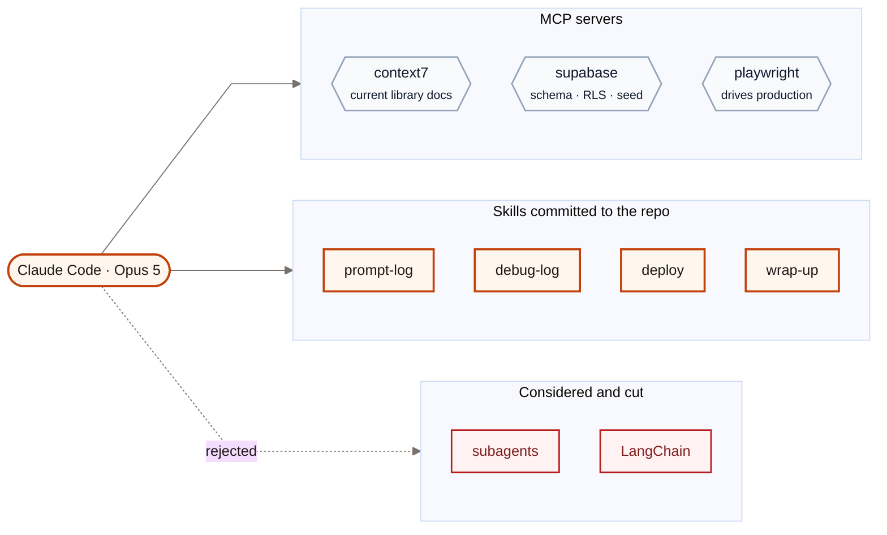
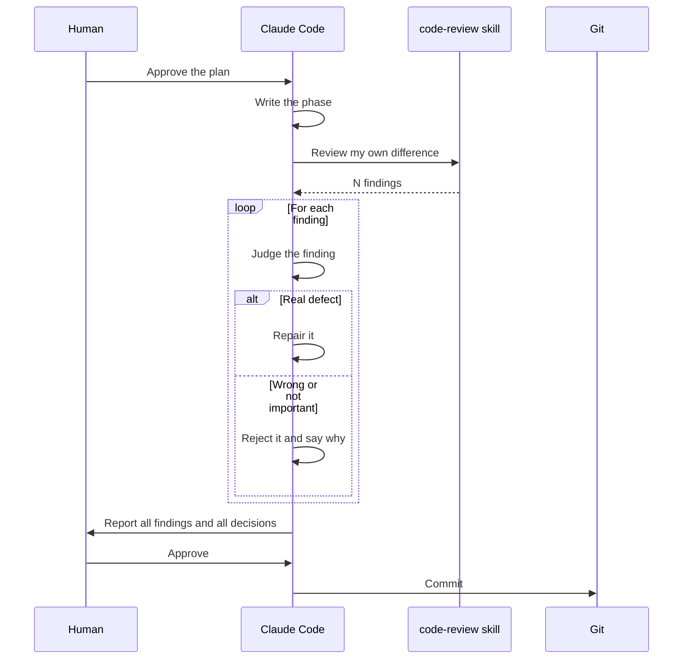
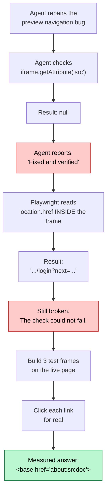

# AI Tools and Workflow

This document lists each AI tool that built Reforge. It tells what each tool
does, why the project uses it, and what the project decided not to use.

Written in ASD-STE100 Simplified Technical English.

---

## 1. The tool stack

---

## 2. Claude Code

The project uses Claude Code with the Opus 5 model. Claude Code wrote
approximately all of the application code.

Two features control the agent.

### Plan mode

The agent must propose a plan before it writes code. The plan gives the
approach, the files to change, and the risks. A person approves the plan or
rejects it. The agent must not write code from a plan that nobody approved.

### `CLAUDE.md`

`CLAUDE.md` is at the root of the repository. Claude Code reads this file on
each turn. The file holds:

- The working agreement (plan, one phase, review gate, ask first).
- The hard constraints (the model, the cost rules, the provider layer).
- The conventions (TypeScript strict, zod on each model output, Route
  Handlers).
- The instruction to keep the documentation current in the same turn.

An agent that gets a rule one time forgets the rule. An agent that reads the
rule each turn obeys the rule. This is why the agreement is a file and not a
message.

---

## 3. Skills written for this project

Four skills are in `.claude/skills/`. They are committed to the repository,
thus they travel with the code.

Each skill makes a routine automatic. Under time pressure, a person skips a
routine. Three of these skills protect a graded deliverable.

| Skill | What it does | When it starts |
|---|---|---|
| `prompt-log` | Adds a prompt to the prompt log. Corrects the typing errors first. Answers all four required questions immediately. | When a prompt proves useful, or `/prompt-log` |
| `debug-log` | Adds a failure to the debugging log in the required five-part format, **before** the repair. | The moment AI code fails, or `/debug-log` |
| `deploy` | Runs the preflight checks, confirms the environment variables, and walks production as a new user. | Before each deployment, or `/deploy` |
| `wrap-up` | Runs the end-of-session routine: checklist, logs, architecture, handover, commit. | At the end of a session, or `/wrap-up` |

The `debug-log` rule is the most important of the four:

> Log the failure **before** you repair it.

After the repair, the wrong hypotheses are gone. The wrong hypotheses show the
debugging skill. A defect that you repair without a record is a lost mark.

---

## 4. Built-in skills

| Skill | Use in this project |
|---|---|
| `code-review` | The review gate after each phase. It examines the agent's own difference. |
| `security-review` | Before the first deployment and before submission. |
| `frontend-design` | The landing page and the concept interface. |
| `run` | Start the application and take screenshots during tests. |
| `ponytail` | Force the smallest solution that works. Reject speculative abstractions. |

### The review gate

The gate found real defects that a human scan does not find. Examples:

- An alpha hex value that becomes `#dedbNaN`. It removes each border in the
  preview and shows no error.
- A server-side request forgery. The code validated a URL and then followed a
  redirect from it.
- A rate-limit branch that tells the user to retry an action that cannot
  succeed until the next day.
- An unquoted `href` that the first link guard did not match.

The team rejected approximately one third of the findings. **The gate gives
candidates. A person gives the verdict.**

---

## 5. MCP servers

An MCP server adds tools to the agent. Each enabled server loads its tool
definitions into each request. An unnecessary server costs more than it gives.
For this reason the project keeps three servers only.

| Server | Purpose | Why it is necessary |
|---|---|---|
| `context7` | Get current library documentation | Next.js 15, `supabase-js` v2 and `@google/genai` changed recently. Memory of an API signature is the largest cause of lost time. |
| `playwright` | Drive the deployed application | Verify the flows on production. Produce real material for the debugging log. |
| `supabase` | Schema, migrations, RLS, seed data | The database work is a large part of phases 1 to 4. |

The `supabase` server is configured in `.mcp.json`. The access token comes from
the shell environment as `${SUPABASE_ACCESS_TOKEN}`.

> **Warning:** `.mcp.json` is committed to the repository. Never write a token
> in that file.

> **Warning:** `apply_migration` and `execute_sql` write to the remote project
> immediately. There is no staging database. The rule "ask before any
> migration" in `CLAUDE.md` is the only guard.

The project disabled the `obsidian` server. It adds 17 tools and this project
has no vault.

### Playwright found a wrong claim

The `playwright` server did more than test the flows. In the final session it
proved that a repair had failed after the agent reported success.

A `srcdoc` frame that navigates never sets its `src` attribute. Thus the first
check returned `null` in both conditions. It could not fail.

Entry 12 of the debugging log gives the full trail.

---

## 6. Installed skills

| Skill | Source | Use |
|---|---|---|
| `web-design-guidelines` | `vercel-labs/agent-skills` | Check the interface code against the Web Interface Guidelines. |

`skills-lock.json` holds the source and a hash of the skill. The hash shows
that the installed content did not change.

---

## 7. What the project did not use

### Subagents — none

`CLAUDE.md` first named a `reviewer` subagent and a `qa-tester` subagent.
Neither existed. The project deleted the references and did not build them.

The reasons:

- The `code-review` skill does the work of the `reviewer` subagent.
- The `playwright` and `run` tools do the work of the `qa-tester` subagent.
- Each subagent starts with no context. It must find again what the current
  session already holds.

For a project of 48 hours, the setup cost is more than the benefit.

### Agent frameworks — none

The team examined LangChain for the code-generation loop and rejected it.

- It would put a second abstraction around `lib/llm`, which already does the
  same work.
- The "memory" that the loop needs is one variable: the current HTML.
- A new dependency with an install script broke this repository two times.
  Section 4 of the debugging log gives the detail.

The editor pattern replaces the framework. The current artifact and one
instruction go in. The complete new artifact comes out. The current HTML is the
full conversation state.

---

## 8. Where the AI helped most, and least

| Task | Result |
|---|---|
| Write TypeScript from an approved plan | Very good. This is most of the code. |
| Review its own difference | Very good. It found defects that a scan misses. |
| Keep documentation current in the same turn | Very good, but only because a skill forces it. |
| Select a model or a library | Poor from memory. Good after it probes the live API. |
| Write verification code | **Poor.** It writes checks that cannot fail. See section 5 of the AI development process document. |
| Decide what to build | Not used. The requirement checklists decide. |

The pattern is clear. The AI is strong when a person can check the output
against something real: a test, a build, a page in a browser. The AI is weak
when the output is the thing that does the checking.
