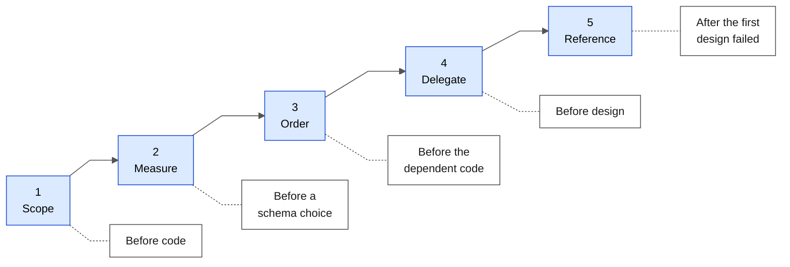

# AI Prompt Log

Five prompts that changed the project. Each one is a prompt **the human wrote**.

Every entry answers the four required questions under four fixed headings:

| Heading | The question it answers |
|---|---|
| **1 — THE PROMPT** | What I asked the AI to do |
| **2 — WHY I PHRASED IT THIS WAY** | Why I structured the prompt in that way |
| **3 — WHAT THE AI PRODUCED** | What the AI produced |
| **4 — WHAT I CHANGED AFTERWARD** | What I changed or corrected, and why |

Written in ASD-STE100 Simplified Technical English.

---

## The five, at a glance

| # | Prompt | What it demonstrates |
|---|---|---|
| 1 | State the brief back as five claims | Control the scope before any code |
| 2 | Test three output formats, then report | Replace an opinion with a measurement |
| 3 | "Run code review first" | Order the work so findings stay cheap |
| 4 | Full autonomy, plus three quality bars | Delegate taste, but keep a measurable bar |
| 5 | "Make it look like v0, Lovable, Replit" | Name the reference, do not describe the style |



---
---

# 1. State the brief back as five claims

**Phase:** 0, before any code · **Date:** 2026-08-25
**Demonstrates:** scope control

## 1 — THE PROMPT

> Before starting any code I want some clarification. Tell me if I got it
> right:
> 1. The user wants to create a product similar to one that exists. He pastes
>    the reference website URL and gives the description of the product he wants
>    and the target users.
> 2. These three go to the AI analyzer layer. It reads the HTML that comes from
>    the URL, to understand the structure of the website, and gets the text.
> 3. Then it sends all of this to an LLM with the description from the user and
>    creates a plan. It shows the plan to the user to confirm the build.
> 4. After the user confirms, it writes the code, tests the output, and gives
>    the user the website in an iframe, with the ability to export the codebase.
> 5. After that, a chat panel opens where the user gives instructions for
>    adjustments.

## 2 — WHY I PHRASED IT THIS WAY

I did not ask the AI to explain the brief. An explanation agrees with itself and
hides nothing.

I gave five claims instead. A claim can be false, thus the AI must give a
verdict for each step. Disagreement then becomes visible.

I included the step that I trusted least, which was step 4. If you commit to a
claim, you give the model something to disprove.

## 3 — WHAT THE AI PRODUCED

It confirmed steps 1, 2, 3 and 5. It rejected step 4.

The required MVP produces a **structured product concept** with six fields. It
does not produce a codebase. Code generation, iframe preview and export are
bonus items, and they are out of scope until the required flow is deployed.

It also gave two corrections that I did not request:

- **There are two display gates, not one.** The analysis is a finished artifact
  that the user reads. "Build My Product" is a **separate** action that makes a
  second artifact. My version puts two graded requirements on one screen.
- **The analyzer does not read the DOM structure.** It gets the HTML, removes
  the markup, and cuts the text to a token budget. The seven fields describe the
  **product**, not the website.

## 4 — WHAT I CHANGED AFTERWARD

I accepted the correction, then made three changes so that the decision stays
after the conversation ends.

1. I wrote the concrete schema shape into the requirements document as an
   `[OUR DECISION]` block. A decision that lives only in a chat history is a
   decision that the next session argues again.
2. I set a limit. The AI presented structured JSON as better. It is not free.
   Deeper nesting is less reliable from a Flash model, and this project has no
   paid fallback. I capped the schema at **moderate** structure. There is no
   full component tree in the MVP.
3. I rejected the implied order of work. Building toward a bonus is correct only
   if it costs nothing now. Each bonus stayed behind the deployed-MVP gate.

The useful output was not the confirmation of the four correct steps. It was the
rejection of the one wrong step. Step 4 as I described it is several days of
work that the brief never asks for.

---
---

# 2. Test three output formats, then report

**Phase:** 3, builder and editor · **Date:** 2026-08-26
**Demonstrates:** replace an opinion with a measurement

## 1 — THE PROMPT

> Before starting Phase 3, tell me what you have planned in simple flow
> diagrams and important details. Tell me what it takes in, what it does and
> what it should output exactly. Then stop for my confirmation.

Then, after I read the plan:

> 1. Test if we get a proper, reliable nested JSON response from Flash.
> 2. Also try XML output. See if XML parsing performs better than JSON. If not:
> 3. Use the string-based method.
> Run the tests first, then give me the results. I will confirm which one to
> move forward with.
>
> NOTE: Keep in mind we are likely to add starter code and visuals later if
> time permits, so keep it modular and easy to add on.

## 2 — WHY I PHRASED IT THIS WAY

There are two controls here.

**I demanded the input and output contract before any code.** The expensive
mistakes live in interfaces. If `/api/refine` returned a patch instead of the
full concept, that decision moves into the route, the storage, the undo
behaviour and the render path before anybody sees it. To read three short
contracts costs minutes. To reverse them costs a phase.

**I refused to accept a guess.** I gave a ranked fallback chain and the order
"run the tests first, then give me the results". That order changed an
architectural coin-flip into an experiment with a decision rule that exists
before the data. Nobody can explain the result away afterwards.

## 3 — WHAT THE AI PRODUCED

A three-variant test harness. It held the model, the temperature, the thinking
level, the token budget, the prompt and the zod validation constant. Only the
wire format changed. Two rounds. 42 live calls.

**Round 1 gave a false pass.** All three variants scored 2 of 2 on "remove the
pricing page". But the diagnostic line said `hadPricing=false`. The generated
concepts never held a pricing page, thus the instruction removed nothing and the
check passed with no content.

Round 2 added a fixture that certainly holds a pricing page. Final result:
**42 of 42. No format was better on correctness.**

## 4 — WHAT I CHANGED AFTERWARD

**I found the empty test and ran the round again.** The harness reported success
and the number was true. The **test** was wrong, not the result. A pass rate
cannot tell you this. Only the `hadPricing=false` field beside it can.

**The decision moved off the measured axis.** The experiment looked for a
reliability difference and found none. The tie-break came from my NOTE about
future visuals: nested `sections: {type, headline, body}[]` renders directly as
visual blocks, and flat `string[]` needs a schema migration to do the same.

I removed XML on a different ground. Gemini enforces `responseJsonSchema` on the
wire and has no equal control for XML, thus its clean result was luck and not a
guarantee.

**One caveat stayed in the report.** Under depth stress the nested variant
returned 5 pages where the others returned 7. That is one sample, thus it is a
signal and not a result. It argues against the recommendation, so I kept it.

---
---

# 3. "Run code review first"

**Phase:** 2, analyzer · **Date:** 2026-08-26
**Demonstrates:** order the work so that findings stay cheap

## 1 — THE PROMPT

> Run code review first, then move towards the frontend.

## 2 — WHY I PHRASED IT THIS WAY

The content of this prompt is the word **first**. It reverses the option that I
preferred.

The server half was load-bearing: `lib/llm`, the site fetcher and
`/api/analyze`. The frontend was about to be written against all three. A review
after the interface exists makes each structural finding invalidate work that
already depends on it. A review at the seam keeps the findings free.

There is a second reason. The site fetcher takes a URL from the user and
requests it from inside our own infrastructure. That is the highest risk in the
project, and the risk does not show itself in a passing test. The feature works
whether or not the guard is correct.

## 3 — WHAT THE AI PRODUCED

Seven findings. All were real. Two were security holes.

- **`redirect: "follow"` defeated the SSRF guard.** The guard validated only the
  URL that the user typed. `fetch` then followed a 302 to any address. A public
  URL that redirects to `169.254.169.254` is fetched, sent to Gemini and stored.
- **The private-range check matched only dotted-quad IPv4.**
  `http://2130706433/` and `http://0x7f000001/` are both 127.0.0.1. Both passed.

It also found five correctness defects, including a `maxDuration` of 60 seconds
below the handler's own worst case of 78 seconds.

## 4 — WHAT I CHANGED AFTERWARD

I repaired all seven. The important part happened while I **verified** them.

I rewrote the guard to resolve the hostname and check the resolved addresses,
then ran the attack list again. Each case returned `BLOCK`. It was reasonable to
stop there.

I read the reasons instead of the verdicts. One line did not fit:

```
BLOCK v4-mapped v6 metadata
      That site took too long to respond.
```

Each other case said `That host can't be analyzed.`, which is the message from
the guard. This one said that the fetch timed out. **Thus the request had gone
out.** The guard had failed, and a network timeout looked like a block.

The cause: the URL parser changes `::ffff:169.254.169.254` into hexadecimal, thus
my dotted-quad pattern never matched. I replaced pattern matching with an IPv6
byte parser, which removes the whole class.

I then added a case that the review did not raise: a public hostname whose DNS
record resolves to a private address. That is the realistic form of this attack.

**Two rules come from this.** A repair is not verified by the tests passing. It
is verified by the **correct cause** of the pass, and only the failure reason
shows the cause. And I wrote the known limit into the source: this is
resolve-then-fetch, not resolve-then-pin, thus DNS rebinding is still open.

---
---

# 4. Full autonomy, plus three quality bars

**Phase:** 5, landing page · **Date:** 2026-08-26
**Demonstrates:** delegate taste, but keep one measurable bar

## 1 — THE PROMPT

> OK, proceed with Phase 5. It's a designing task, so proceed with full
> autonomy. Make sure everything fits exactly in its place, looks clean and
> professional, and is secure.

## 2 — WHY I PHRASED IT THIS WAY

Full autonomy on a **design** task is different from full autonomy on an
implementation task. Neither party can judge a landing page from a description,
thus to build it and look at it is faster than to approve a plan for it.

But autonomy with no bar gives a result that is plausible and generic. Thus the
prompt carries three bars, and they are different in kind:

| Bar | Kind | Why it is there |
|---|---|---|
| "fits exactly in its place" | Measurable | You can check it with numbers |
| "clean and professional" | Taste | Subjective, but it sets the target |
| "is secure" | Unexpected | It does not obviously apply to a static page |

## 3 — WHAT THE AI PRODUCED

A specification-sheet direction that comes from the product itself. Reforge
emits typed, labelled, structured data, thus the page uses the same form:
monospace keys, visible rules, one accent colour, and section markers written as
paths.

The hero panel shows the product's **real output in its real shape**. It is also
the required product demonstration, thus the demonstration cannot drift away
from what the product does.

## 4 — WHAT I CHANGED AFTERWARD

**The measurable bar did most of the work.** "Fits exactly in its place" became
a real assertion: the label, the price and the button of each pricing card must
share one pixel row. Three rounds of screenshot review then found faults that
reading the code does not find:

- The headline put "pieces." alone on the last line.
- The buttons did not align, because the tiers hold different numbers of items.
- The "POPULAR" badge pushed the featured card down by 2 pixels.

All three were invisible in the markup and obvious in a screenshot.

**The security bar found the one real risk.** The header shows authentication
state. An authentication-aware page that gets cached serves the session state of
one visitor to another. The build output confirmed `ƒ /`, thus Next.js had made
the route dynamic. This is a **trade**: the landing page now costs one server
render for each visit.

**I spent the freedom against the defaults.** AI design collects around
cream-and-terracotta serif, black with acid green, and newspaper hairlines. I
named those three and refused all of them. That is what stopped "clean and
professional" from becoming "templated".

---
---

# 5. "Make it look like v0, Lovable, Replit"

**Phase:** Redesign · **Date:** 2026-08-26
**Demonstrates:** name the reference, do not describe the style

## 1 — THE PROMPT

I first offered three named design skills and asked which to use. I then refused
all three:

> wait for me to tell you and provide you with some referencing designs to work
> on.

One hour later:

> I want it to look something like v0, Lovable, Replit. The current UI is too
> simple. If we intend to make this a startup page we should have it look like
> an actual good startup page with all the UI enhancements, loaders, animations,
> to make it attractive and feel like a real product instead of some plain old
> generic demo. We should consider adding background images, logos, gradients,
> stylish buttons. Make the app light and dark theme toggleable and it should
> take the default system theme as well as have a toggle. You have full autonomy
> so do not stop in between.

## 2 — WHY I PHRASED IT THIS WAY

My first question was wrong. I asked **which skill should drive this**, which is
an implementation detail. The answer that controls the work is **what should it
look like**.

Three named products carry more usable information than any adjective. They fix
the surface treatment, the motion budget, the density and the tone at the same
time, with no ambiguity.

The refusal to select from my own list was the useful part. Sometimes the
correct answer to "which of A, B or C" is "none of them, here is the real
input".

## 3 — WHAT THE AI PRODUCED

Reading the references instead of the adjectives changed two decisions that the
literal words would have made wrong:

1. **"Gradients" did not mean a purple and blue gradient.** That gradient is the
   signature of generated design. To follow my word exactly gives the "generic
   demo" look that my request tries to escape. The AI used an **ember and
   copper** accent instead, which ties to the name *Re-forge*.
2. **"Background images" had no source.** No image generation was available, and
   zero recurring cost is a hard constraint, which removes hosted stock images.
   The AI built the depth in CSS: a fixed three-orb radial mesh, an SVG grain
   layer, and masked hairline grids. Zero bytes, and no asset that can go
   missing.

## 4 — WHAT I CHANGED AFTERWARD

Three defects appeared only when a person drove the interface in a browser:

| Defect | Cause | Repair |
|---|---|---|
| The button icon disappeared in dark mode | It took its theme from the page, but the primary button **inverts** | Tint from `currentColor` |
| White on ember measured 2.23:1 | `--ember` flips with the theme, thus a fixed `text-white` passes in only one | Add an `--ember-contrast` token. Now 5.06 and 8.61 |
| A custom class deleted `pt-24` | `.safe-top` shadowed the Tailwind utility by source order | Use the arbitrary-value syntax. See debugging entry 7 |

Each defect was invisible in one theme or one viewport and correct in the other.
A single-theme design process never finds this class of defect. **My request for
both themes is what made them findable.**
