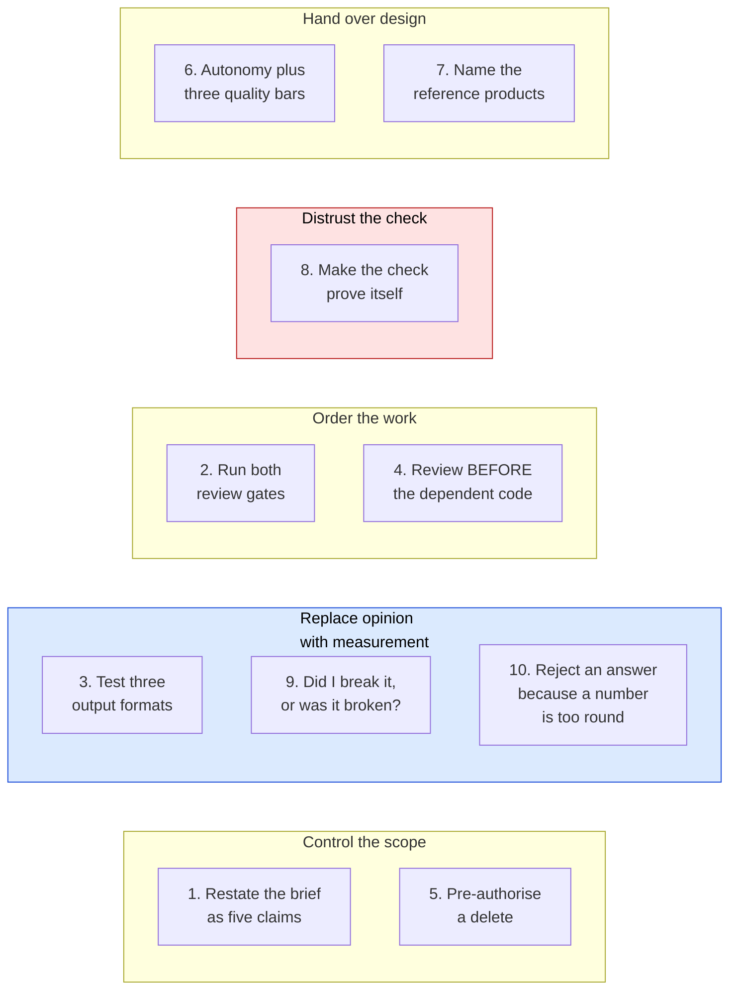

# AI Prompt Log

Ten prompts that changed the project. Each entry answers the four required
questions:

1. What I asked the AI to do.
2. Why I structured the prompt in that way.
3. What the AI produced.
4. What I changed after that.

The team wrote each entry at the moment the prompt proved useful. The team did
not write these entries at the end. You cannot remember "why I phrased it that
way" three days later.

Written in ASD-STE100 Simplified Technical English.

---

## How the prompts divide



---

## 1. State the brief as claims that the AI can reject

**Phase:** 0 · **Date:** 2026-08-25

### What I asked

> Before starting any code I want some clarification. Tell me if I got it
> right:
> 1. The user wants to create a product similar to one that exists. He pastes
>    the reference website URL and gives the description of the product he
>    wants and the target users.
> 2. These three go to the AI analyzer layer. It reads the HTML that comes from
>    the URL, to understand the structure of the website, and gets the text.
> 3. Then it sends all of this to an LLM with the description from the user and
>    creates a plan. It shows the plan to the user to confirm the build.
> 4. After the user confirms, it writes the code, tests the output, and gives
>    the user the website in an iframe, with the ability to export the
>    codebase.
> 5. After that, a chat panel opens where the user gives instructions for
>    adjustments.

### Why I structured it in that way

I did not ask the AI to explain the brief. An explanation agrees with itself
and hides nothing.

I gave five claims instead. A claim can be false. The AI must give a verdict for
each step, thus disagreement becomes visible.

I included the step that I trusted least, which was step 4. If you commit to a
claim, you give the model something to disprove.

### What the AI produced

The AI confirmed steps 1, 2, 3 and 5. It rejected step 4.

The required MVP produces a **structured product concept** with six fields. It
does not produce a codebase. Code generation, iframe preview, test execution
and export are bonus items. They are out of scope until the required flow is
deployed.

The AI also gave two corrections that I did not request:

- **There are two display gates, not one.** I believed the flow was analysis,
  then confirm, then build. In fact the analysis is a finished artifact that the
  user reads. "Build My Product" is a separate action that makes a second
  artifact. My version puts two graded requirements on one screen.
- **The analyzer does not read the DOM structure.** It gets the HTML, removes
  the markup, and cuts the text to a token budget. The seven fields describe the
  **product**, not the website.

### What I changed after that

I accepted the correction. I then made three changes so that the decision stays
after this conversation ends.

1. I added an `[OUR DECISION]` block to the requirements document with the
   concrete schema shape. A decision that lives only in a chat history is a
   decision that the next session argues again.
2. I set a limit. The AI presented structured JSON as better. It is not free.
   Deeper nesting is less reliable from a Flash model, and this project has no
   paid fallback. I recorded the trade and limited the schema to **moderate**
   structure. There is no full component tree in the MVP.
3. I rejected the implied order of work. Building toward a bonus is correct only
   if it costs nothing now. I kept the constraint as "render as a pure function
   of the concept object" and left each bonus behind the deployed-MVP gate.

The useful output was not the confirmation of the four correct steps. It was the
rejection of the one wrong step. Step 4 as I described it is several days of
work that the brief never asks for.

---

## 2. Run both review gates, and act on the results

**Phase:** 1 — Database and authentication · **Date:** 2026-08-25

### What I asked

> /security-review

> /code-review medium

### Why I structured it in that way

The important choice is **when**, not what.

Both gates ran after the feature worked in a browser, but before the commit. At
that point the code is complete enough for an honest review and still cheap to
change. An earlier review examines an incomplete design. A later review makes
each finding compete with the next phase.

I also kept the two gates separate. `security-review` looks for vulnerabilities
and ignores style. `code-review` looks for correctness defects. One reviewer
with both goals gives a list in order of "easy to see", not in order of impact.

### What the AI produced

`security-review` found one real vulnerability that I wrote:

```ts
router.replace(next && next.startsWith("/") ? next : "/dashboard");
```

`startsWith("/")` looks like "a path on this site". It is not. `//evil.com`
starts with a slash and is a protocol-relative URL. The browser goes to another
site.

The attack is dangerous because each legitimate part is real. The victim opens
`https://<our-domain>/login?next=//evil.com`, signs in correctly on the real
site, and then arrives at an attacker page that looks like the dashboard and
asks for the password again.

`code-review` found four more defects. Three were in the middleware:

- Both redirect branches returned a new `NextResponse.redirect`. This **removes
  the rotated authentication cookies** that `getUser()` had just written. A user
  whose token refreshed on `/login` is signed out on the next request.
- The unauthenticated branch did not clear `url.search`, thus a deep link lost
  its query string.
- The seven `create policy` statements were the only lines in the migration that
  you cannot run two times.

### What I changed after that

I repaired all five. Two decisions went further than the report.

1. **I repaired the class, not the reported string.** The review named
   `//evil.com`. I wrote `lib/safe-redirect.ts` for the whole class:
   protocol-relative forms, backslash forms such as `/\evil.com`, absolute URLs,
   `javascript:` schemes, and control characters after the first slash. The
   function resolves the value through `new URL()` against a disposable origin
   and confirms that the origin did not change. I then wrote 19 test cases,
   including the valid paths that must still work.
2. **I applied the repair in a second place that the review did not name.** The
   middleware builds the `next` parameter from `request.nextUrl.pathname`. A
   request to `https://host//evil.com` has the pathname `//evil.com`. The review
   found the sink. It did not find the other source that feeds the sink.
3. **On the migration, I did more than make it repeatable.** Migration 0001
   created `set_updated_at()` as `SECURITY DEFINER`. Migration 0002 had already
   repaired that on the live project. A repeatable 0001 would put the
   vulnerability back each time it runs. I corrected 0001 in place and recorded
   why.

**What I take from this:** the best finding was in code whose own comment
described the defect that the code contained. I wrote the warning about the
rotated cookies, and then removed those cookies nine lines later. Self-review
does not find that. The comment reads as proof that the case is handled, so the
eye moves on.

---

## 3. Test three output formats before you select one

**Phase:** 3 — Builder and editor · **Date:** 2026-08-26

### What I asked

> Before starting Phase 3, tell me what you have planned in simple flow
> diagrams and important details. Tell me what it takes in, what it does and
> what it should output exactly. Then stop for my confirmation.

Then, after I read the plan:

> 1. Test if we get a proper, reliable nested JSON response from Flash.
> 2. Also try XML output. See if XML parsing performs better than JSON. If not:
> 3. Use the string-based method.
> Run the tests first, then give me the results. I will confirm which one to
> move forward with.
>
> NOTE: Keep in mind we are likely to add starter code and visuals later if
> time permits, so keep it modular and easy to add on.

### Why I structured it in that way

There are two separate controls here.

**I demanded the input and output contract before any code.** "What it takes in,
what it does, what it should output exactly" asks for the interface, not the
implementation. The expensive mistakes live in interfaces. If `/api/refine`
returned a patch instead of the full concept, that decision moves into the
route, the storage, the undo behaviour and the render path before anybody sees
it. To read three short contracts costs minutes. To reverse them costs a phase.

**I refused to accept a guess.** I gave a ranked fallback chain and the order
"run the tests first, then give me the results". That order changed an
architectural coin-flip into an experiment with a decision rule that exists
before the data. Nobody can explain the result away after the fact.

### What the AI produced

A three-variant test harness. It held the model, the temperature, the thinking
level, the token budget, the prompt and the zod validation constant. Only the
wire format changed. Two rounds. 42 live calls.

**Round 1 gave a false pass.** All three variants scored 2 of 2 on "remove the
pricing page". But the diagnostic line said `hadPricing=false`. The generated
concepts never held a pricing page. The instruction removed nothing, and the
check passed with no content. A green row measured nothing.

Round 2 added a fixture concept that certainly holds a pricing page, an additive
test, and a depth-stress build. Final result: **42 of 42. No failures. No format
was better on correctness.**

### What I changed after that

**I found the empty test and ran the round again.** The harness reported success
and the number was true: two of two trials passed. The **test** was wrong, not
the result. A pass rate cannot tell you this. Only the `hadPricing=false` field
beside it can. I discarded the round 1 numbers.

**The decision moved off the measured axis.** The experiment looked for a
reliability difference and found none. The tie-break came from the NOTE about
future visuals. Nested `sections: {type, headline, body}[]` renders directly as
visual blocks. Flat `sections: string[]` needs a second parse or a schema
migration to do the same.

I removed XML on a different ground. Gemini enforces `responseJsonSchema` on the
wire and has no equal control for XML. Its clean result was luck, not a
guarantee. XML also produced 2.2 times the characters of flat JSON.

**One caveat stayed in the report.** Under depth stress, the nested variant
returned 5 pages where the other two returned 7. This is one sample, thus it is
a signal and not a result. It argues against the recommendation, so I kept it.

---

## 4. Order the review before the code that will depend on it

**Phase:** 2 — Analyzer · **Date:** 2026-08-26

### What I asked

> Run code review first, then move towards the frontend.

### Why I structured it in that way

The content of this prompt is the word **first**. It reverses the option that I
preferred.

The server half was the load-bearing part: `lib/llm`, the site fetcher and
`/api/analyze`. The frontend was about to be written against all three. A review
after the interface exists makes each structural finding invalidate work that
already depends on it. A review at the seam keeps the findings free.

There is a second reason. The site fetcher takes a URL from the user and
requests it from inside our own infrastructure. That is the highest risk in the
project, and the risk does not show itself in a passing test. The feature works
correctly whether or not the guard is correct.

### What the AI produced

Seven findings. All were real. Two were security holes.

- **`redirect: "follow"` defeated the SSRF guard.** `assertPublicUrl` validated
  only the URL that the user typed. `fetch` then followed a 302 to any address.
  A public URL that redirects to `169.254.169.254` is fetched, sent to Gemini
  and stored.
- **The private-range check matched only dotted-quad IPv4.**
  `http://2130706433/`, `http://127.1/` and `http://0x7f000001/` are all
  127.0.0.1. All three passed.

It also found five correctness defects. One was a `maxDuration` of 60 seconds
below the handler's own worst case of 78 seconds.

### What I changed after that

I repaired all seven. The important part happened while I **verified** the
repairs.

I rewrote the guard to resolve the hostname and check the resolved addresses. I
then ran the attack list again. Each case returned `BLOCK`. It was reasonable to
stop there.

I read the reasons instead of the verdicts. One line did not fit:

```
BLOCK v4-mapped v6 metadata
      That site took too long to respond.
```

Each other case said `That host can't be analyzed.`, which is the message from
the guard. This case said that the fetch timed out. **Thus the request had gone
out.** The guard had failed, and a network timeout looked like a block.

The cause: the URL parser changes `::ffff:169.254.169.254` into hexadecimal as
`::ffff:a9fe:a9fe`. My dotted-quad pattern never matched it. I replaced pattern
matching with an IPv6 byte parser, which removes the whole class.

I then added a case that the review did not raise and my own list did not hold:
a public hostname whose DNS record resolves to a private address
(`169.254.169.254.nip.io`). That is the realistic form of this attack. Only the
resolve-then-check design finds it.

**Two rules come from this.** First, the repairs passing does not verify a
repair. The **correct cause** of the pass verifies it, and only the failure
reason shows the cause. Second, I wrote the known limit into the source: this is
resolve-then-fetch, not resolve-then-pin, thus DNS rebinding is still open. An
honest comment about a known limit is better than silence that reads as full
coverage.

---

## 5. Pre-authorise a destructive action, before it is needed

**Phase:** 2 to 3 boundary · **Date:** 2026-08-26

### What I asked

> OK push it. Also we will create a demo account later on, no need to keep
> anything from testing right now. What's the next step?

### Why I structured it in that way

Three instructions in two lines. The middle one is important.

It gives permission for a destructive action — deleting live rows from the
production database — before the action comes up. That is when such permission
is cheap to give and safe to think about.

It also settles a question from the turn before. I decided **not** to promote
the test account into the required demo account. Build the demo account on
purpose later. Do not inherit one by accident. Test data in a graded submission
looks like carelessness, even when it is harmless.

### What the AI produced

A push to `main`, an automatic deployment, and a production test as a new user:
sign up, analyze, seven fields, reopen with zero `/api/` calls, sign out, and a
deep link that keeps `next`.

Two things went wrong. Neither was in the application code.

**A probe reported a deployment that it had not verified.** It requested
`/dashboard/new` and expected a redirect to prove that the new route existed. It
printed `DEPLOY LIVE` after 15 seconds. But the middleware guards
`/dashboard/*` and redirects whether or not the page exists. The probe gives the
same answer against the old build.

**Two Playwright screenshots were committed to the repository root.** That is
365 KB of test files in a repository whose cleanliness is graded. They appeared
only because `security-review` prints the file list of the difference.

### What I changed after that

**I listed the rows before I deleted them.** The instruction authorised the
delete. I first listed each account with its project count. Two rows, both mine,
one project each, no third-party data. Then the delete ran. A count query
confirmed `users 0, projects 0, refinements 0`, which proves that the cascade
worked. General permission to delete is not permission to delete without
looking.

**I removed the screenshots and closed the path that let them in.**
`.playwright-mcp/` was already in `.gitignore`. I had given bare filenames to
the screenshot tool, thus the files landed in the working directory. A `/*.png`
ignore rule stops the next occurrence.

**The lesson is about my own tools.** Both failures were in code that I wrote to
**check** things. Verification tools get no review and no tests, and you trust
them exactly when they say what you hope to hear.

---

## 6. Give full autonomy on design, with three quality bars

**Phase:** 5 — Landing page · **Date:** 2026-08-26

### What I asked

> OK, proceed with Phase 5. It's a designing task, so proceed with full
> autonomy. Make sure everything fits exactly in its place, looks clean and
> professional, and is secure.

### Why I structured it in that way

Full autonomy on a **design** task is different from full autonomy on an
implementation task. Design is where a round trip costs most. Neither person can
judge a landing page from a description. To build it and look at it is faster
than to approve a plan for it.

But autonomy with no bar gives a result that is plausible and generic. Thus the
prompt carries three bars, and they are different in kind:

- **"fits exactly in its place"** is a **measurable** bar. It is not "looks
  tidy". You can check it with numbers.
- **"clean and professional"** is a taste bar. It is subjective.
- **"is secure"** is a bar that does not obviously apply to a static marketing
  page. That is why it was useful.

### What the AI produced

A specification-sheet direction that comes from the product itself. Reforge
emits typed, labelled, structured data, thus the page uses the same form:
monospace keys, visible rules, one accent colour, and section markers written as
paths such as `/how` and `/pricing`. Three type roles and no more.

The hero panel shows the product's **real output in its real shape**: a
`linear.app` teardown that becomes a solo issue tracker. It is also the required
product demonstration, thus the demonstration cannot drift away from what the
product does.

### What I changed after that

**The measurable bar did most of the work.** "Fits exactly in its place" became
a real assertion: the label, the price and the button of each pricing card must
share one pixel row. Three rounds of screenshot review then found faults that
reading the code does not find:

- The headline put "pieces." alone on the last line.
- The buttons did not align at the bottom, because the tiers hold different
  numbers of items.
- The "POPULAR" badge pushed the content of the featured card down by 2 pixels.

All three were invisible in the markup and obvious in a screenshot.

**The security bar found the one real risk.** A static marketing page has almost
no attack surface. But the header shows authentication state. An
authentication-aware page that gets cached serves the session state of one
visitor to another. The build output confirmed `ƒ /`, thus Next.js had correctly
made the route dynamic. This is a **trade** and not a free win: the landing page
now costs one server render for each visit.

**I spent the freedom against the defaults.** AI design collects around
cream-and-terracotta serif, black with acid green, and newspaper hairlines. I
named those three and refused all of them. That is what stopped "clean and
professional" from becoming "templated".

---

## 7. Name the reference products instead of describing the style

**Phase:** Redesign · **Date:** 2026-08-26

### What I asked

I first offered three named design skills and asked which to use. The answer
refused all three:

> wait for me to tell you and provide you with some referencing designs to work
> on.

One hour later:

> I want it to look something like v0, Lovable, Replit. The current UI is too
> simple. If we intend to make this a startup page we should have it look like
> an actual good startup page with all the UI enhancements, loaders, animations,
> to make it attractive and feel like a real product instead of some plain old
> generic demo. We should consider adding background images, logos, gradients,
> stylish buttons. Make the app light and dark theme toggleable and it should
> take the default system theme as well as have a toggle. You have full autonomy
> so do not stop in between.

### Why I structured it in that way

My first question was wrong. I asked **which skill should drive this**, which is
an implementation detail. The answer that controls the work is **what should it
look like**.

Three named products carry more usable information than any adjective. They fix
the surface treatment, the motion budget, the density and the tone at the same
time, with no ambiguity.

The refusal to select from my list was the most useful part. Sometimes the
correct answer to "which of A, B or C" is "none of them, here is the real
input".

### What the AI produced

Reading the references instead of the adjectives changed two decisions that the
literal words would have made wrong:

1. **"Gradients" did not mean a purple and blue gradient.** The purple-blue AI
   gradient is the signature of generated design. Each generic AI SaaS
   demonstration uses it. To follow the word exactly gives the "generic demo"
   look that the request tries to escape. The AI used an **ember and copper**
   accent instead. It ties to the name *Re-forge*, it is warm like Lovable, and
   it differs from the monochrome of v0.
2. **"Background images" had no source.** No image generation was available, no
   asset pipeline exists, and zero recurring cost is a hard constraint, which
   removes hosted stock images. The AI built the depth in CSS instead: a fixed
   three-orb radial mesh, an SVG `feTurbulence` grain layer, and masked hairline
   grids. Zero bytes and no asset that can go missing.

### What I changed after that

Three defects appeared only when a person drove the interface in a browser:

- **`ButtonIcon` took its theme from the page, not from the button.** It used
  `bg-black/8 dark:bg-white/12`. The primary button **inverts** with the theme,
  thus in dark mode it drew a white shape on a white button and disappeared. The
  repair tints from `currentColor`, which is correct for each variant.
- **White text on ember measured 2.23:1.** `--ember` is dark in the light theme
  and light in the dark theme, thus a fixed `text-white` can pass in only one of
  them. An `--ember-contrast` token now flips with the theme. The result is 5.06
  and 8.61.
- **The `.safe-top` class silently removed `pt-24`.** See entry 7 of the
  debugging log.

Each of the three was invisible in one theme or one viewport and correct in the
other. A single-theme design process never finds this class of defect. The
request for both themes is what made them findable.

---

## 8. Make the check prove itself before you trust it

**Phase:** Redesign · **Date:** 2026-08-26

### What I asked

Two times, a check reported a failure and I asked for the cause instead of a
repair:

> 11 of 19 never revealed. Let me find the actual reason rather than assume.

> Five failures, all the same element, and the ratio of exactly 1.0 is
> suspicious. My parser only handles `rgb()`, but these compute to `oklch()`.
> Let me resolve colours properly before trusting this.

### Why I structured it in that way

A failing result deserves the same doubt as a passing result. The difference is
the cost. A false failure costs a repair that you do not need. A false pass
ships a defect.

Both results had a sign. "11 of 19 hidden" is too many for a real regression
when the visible ones work. A contrast ratio of **exactly** 1.0 means that the
foreground and the background resolved to the same value, which almost always
means that a parser returned a default instead of a measurement.

### What the AI produced

Both were defects in the check. Both would have caused real damage.

- **The scroll-reveal check** used `window.scrollTo` while `html` had
  `scroll-behavior: smooth`. Each step queued an animated scroll that never
  arrived, thus the page never reached the lower sections. With
  `behavior: 'instant'` the result was **19 of 19**. A "repair" would have
  removed the `IntersectionObserver` and lost the entry animation on the whole
  site.
- **The contrast audit** matched only `rgb()` and `rgba()` with a pattern. The
  design system is written in `oklch()`. Colours that did not parse fell to a
  white default, which gives a ratio of 1.0 against white text.

The corrected audit then found a **real** failure that the broken one had hidden
in noise: white on ember at 2.23:1.

### What I changed after that

I kept the canvas-based colour resolver as the standard method for the rest of
the pass. I ran it again across both themes and all three surfaces, and I
reported the **worst** ratio for each token instead of one sample. That found a
second real failure that the first version missed: `--faint` at 4.37 against the
raised surface in the light theme.

Final state: each text token is at or above 4.5:1 against each surface in both
themes. The worst case is 4.69.

**The rule:** a broken checker does not fail loudly. It produces **plausible**
numbers. The defence is not more checks. The defence is to ask "what would this
look like if the checker itself were wrong?" before you act on a result.

---

## 9. Ask whether you broke it, or whether it was already broken

**Phase:** Bonus phases · **Date:** 2026-08-27

### What I asked

> Before debugging this: did I break it, or was it already broken? Check out the
> commit before tonight's work in a separate worktree and run the same probe
> against the same API key. Tell me which.

### Why I structured it in that way

The failing request gave `400 Request contains an invalid argument`. That
message names no field and no path. The difference in progress had edited
exactly the file that builds the request. Each instinct pointed at the new code.

The prompt refuses the plausible explanation until a test confirms it. "Did I
break this" is a cheap question with a binary answer. To answer it wrong costs
an hour of debugging the wrong file. A Git worktree makes the test almost free.

The wording is important in one more way. It does not ask "is my change
correct", which invites the model to read the difference and find something
plausible to blame. It asks for a **measurement against a control**.

### What the AI produced

A worktree at `a2c9dc5`, a symbolic link to `node_modules`, and the same probe:

```
PRE-PHASE conceptSchema: FAILED {"error":{"code":400,...,"status":"INVALID_ARGUMENT"}}
```

The same failure on code that is older than every line written that night. The
new image branch was innocent. Google had made `responseJsonSchema` validation
more strict on the server. `/api/build` and `/api/refine` had been broken in
production for hours with no deployment, no commit and no alert.

### What I changed after that

Nothing about the answer. But the investigation needed two more corrections, and
both came from the same instinct.

The next four hypotheses were all wrong. The fifth round gave results that
looked **inconsistent**: the same small schema failed one time and then passed
three times. That looked like an unreliable API and almost stopped the
investigation.

It was not unreliable. Each probe rebuilt its sub-schema with a new
`z.object({...})` call, which emits different JSON than a slice of the real
schema. "The same test two times" never happened. **When results look random,
suspect the test before the system.**

What worked was to stop making hypotheses and to enumerate instead: list each
JSON Schema keyword that is present, then remove them one group at a time. Two
keywords each repaired it alone, which is the shape of the defect. Gemini
rejects `minItems` and `maxItems` **when the same schema also holds an `enum`**.
Entry 9 of the debugging log gives the full trail.

---

## 10. Reject an explanation because a number is too round

**Phase:** Bonus 3 — Code generation · **Date:** 2026-08-27

### What I asked

> `finish_reason` says stop and the document is exactly 10240 characters. That
> is 10 x 1024, too round to be a model choice. Test whether other models on the
> same tier truncate at the same number, with the same prompt.

### Why I structured it in that way

The evidence supported the wrong conclusion. HTTP 200. Valid JSON. A string that
matches the schema. `finish_reason: "stop"`. Each available signal said that the
request succeeded and that the model chose to stop.

To accept that leads to prompt tuning. I tried that first and it made the result
**worse**. The instruction "keep the document under 11000 characters" produced a
longer broken page, because a limit makes the model spend its budget and stop in
the middle of a tag.

`10240` is the fact that does not fit. Models do not stop on power-of-two
boundaries. Buffers do.

The prompt names the observation that contradicts the explanation. It then asks
for a **comparison across models**, not an opinion. If it is a platform limit,
other models on the platform hit the same wall. If it is a model choice, they do
not.

### What the AI produced

```
qwen/qwen3.8-27b     out_tok=3338  chars=10240  ends_with_</html>=false
openai/gpt-oss-20b   out_tok=3000  chars=2979   ends_with_</html>=true
openai/gpt-oss-120b  out_tok=2390  chars=3757   ends_with_</html>=true
```

The JSON-schema decoder of Groq limits a string value to 10240 characters. It
closes the JSON correctly around the cut and still reports `"stop"`. A platform
limit that looks like a model choice.

### What I changed after that

Two things, because the model choice alone is a repair that expires.

I pinned `openai/gpt-oss-120b`. It gives complete documents in one third of the
output tokens, which also leaves room for an edit inside the same per-minute
budget.

But a model choice is not a guarantee, thus the **schema** now enforces the
property that was broken in silence:

```ts
.refine((html) => html.trimEnd().endsWith("</html>"), {
  message: "The document is incomplete — it must end with a closing </html> tag.",
})
```

A cut page now fails validation and goes into the stricter retry. It is not
stored.

The general rule: **for anything that a model generates in one pass, assert on
the closing condition.** Each other signal tells you that it worked.

The instruction changed too. It is no longer a character limit. It is now "the
last characters you write must be the closing `</html>` tag". A request for a
shorter page produced a longer broken one. A request for a finished page
produced a shorter complete one.
