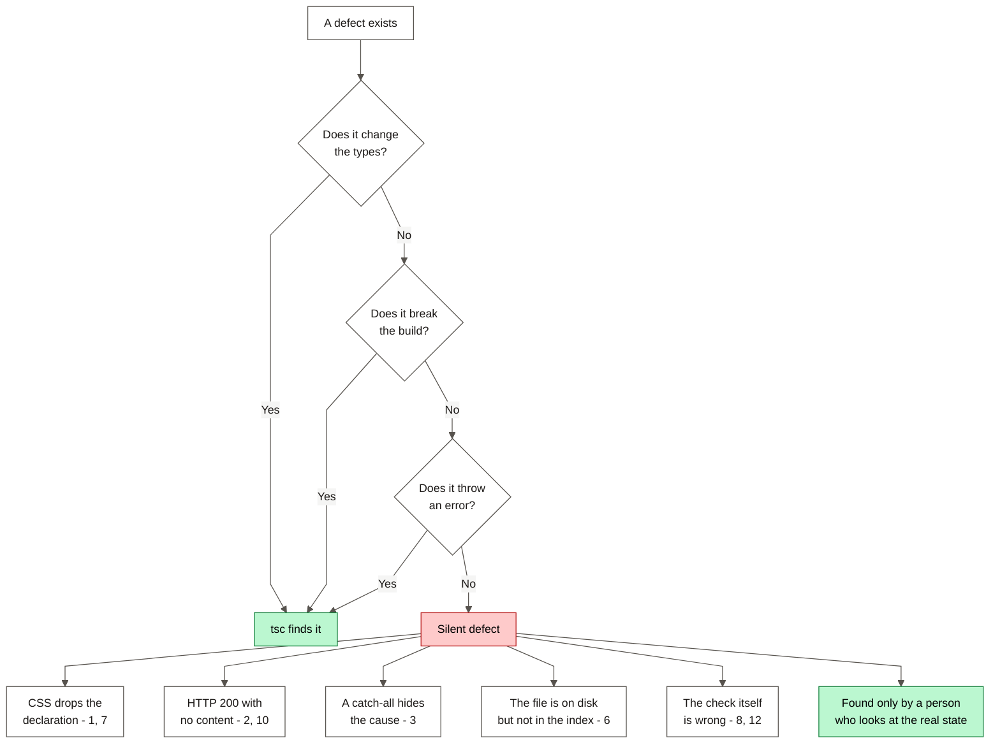
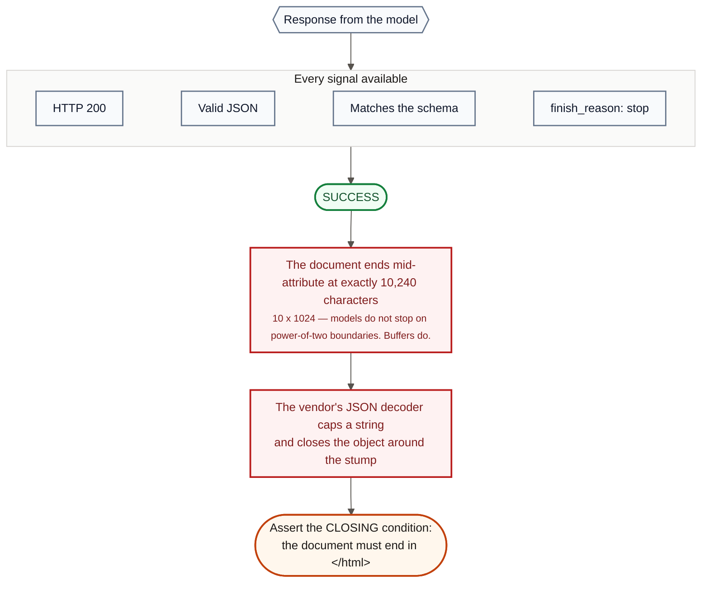

# Debugging Log

Thirteen real failures of AI-generated code. Each entry uses the required format:

**Problem → AI prompt → Attempted solution → Debugging → Final solution**

The team wrote each entry at the moment of the failure, **before** the repair.
After a repair, the wrong hypotheses are gone, and the wrong hypotheses show the
method.

Written in ASD-STE100 Simplified Technical English.

---

## The pattern across all thirteen

Eleven of the thirteen failures passed each automatic gate. This is the most
important fact in this document.



| Entry | Each gate passed? | What found it |
|---|---|---|
| 1 Font falls back to serif | Yes | A screenshot |
| 2 Empty model response | Yes | Reading `usageMetadata` |
| 3 Signup 502 | Yes | A direct request to the upstream API |
| 4 Install script blocks the build | **No** | `pnpm lint` failed |
| 5 The form empties itself | Yes | Reading the DOM after the error |
| 6 `.gitignore` hides a route | Yes | Counting the staged files |
| 7 A CSS class deletes a utility | Yes | Reading the **computed** style |
| 8 The menu covers its close button | Yes | Hit testing with `elementFromPoint` |
| 9 Gemini rejects the schema | Yes | A probe against an older commit |
| 10 Three broken-page failures | Yes | Comparing three models |
| 11 A backtick ends a template | **No** | `pnpm check` |
| 12 The preview navigates to login | Yes | Reading `location.href` inside the frame |
| 13 A diagram that never rendered | Yes | Rendering it, instead of reading the source |

---

## 1. The Geist font falls back to serif

**Phase:** 0 — Bootstrap · **Date:** 2026-08-25

### Problem

The placeholder page built and rendered with a clean console. There were zero
errors and zero warnings. But each character on the page was **serif**. The
expected font was Geist, a sans-serif font.

Nothing reported this. `pnpm lint` was clean. `pnpm build` was clean. The
browser console was clean. A CSS custom property that does not resolve raises no
error. The browser drops the declaration and uses a fallback font. Only a
screenshot found it.

### AI prompt

No single prompt caused this. Two code generators ran one after the other:

```bash
npx create-next-app@15 reforge --typescript --tailwind --eslint --app
pnpm dlx shadcn@latest init --base radix --preset nova --yes
```

Each tool is correct alone. `create-next-app` writes `app/layout.tsx` and
`app/globals.css` as a matched pair. `shadcn init` then **replaces
`globals.css`** and does not change `layout.tsx`. Neither tool knows that the
other tool ran.

### Attempted solution

The first reading looked clear. `globals.css` used `--font-sans`:

```css
@theme inline {
  --font-sans: var(--font-sans);
}
```

`layout.tsx` declared the font with a different name:

```ts
const geistSans = Geist({ variable: "--font-geist-sans" });
```

Diagnosis: the names do not match. Repair: rename in `layout.tsx`.

This was plausible. It made the two files agree. It was **wrong**. It also
looked like it worked, because the page was serif before the change and serif
after it. There was no new symptom.

### Debugging

The rename did not help. That was the useful signal. A name mismatch would have
been repaired by matching the names.

Three cheap hypotheses were removed first:

- **Geist fails to download.** No. `next/font/google` hosts the font at build
  time. A fetch failure stops the build, and the build was green.
- **A stale build cache.** No. The serif font stayed after a new `pnpm build`.
- **The preset uses serif on purpose.** No. The preset targets `--font-sans`. It
  does not declare a serif stack.

A search of the CSS showed line 10 as `--font-sans: var(--font-sans)`. That is a
variable defined as itself, which is a cycle. A cycle computes to an invalid
value, thus `font-family` is dropped.

I removed the cycle. **The page was still serif.** That was the second dead end.

I then stopped reading the CSS and asked the browser what it had computed:

```js
const cs = getComputedStyle(document.documentElement);
const bs = getComputedStyle(document.body);
({
  htmlFontFamily:      cs.fontFamily,                            // "Times New Roman"
  varOnHtml_geistSans: cs.getPropertyValue('--font-geist-sans'), // ""  <-- empty
  varOnBody_geistSans: bs.getPropertyValue('--font-geist-sans'), // "Geist", "Geist Fallback"
})
```

The cause had nothing to do with names. `create-next-app` puts the font
variable classes on **`<body>`**. The shadcn preset applies `font-sans` to
**`<html>`**. CSS custom properties inherit **downward**. `<html>` cannot see a
variable that its own child declares.

Thus on `<html>` the variable is empty, `font-family` is dropped, and the
browser uses serif. `<body>` then inherits that broken `font-family` from
`<html>`. This is why the whole page was serif although `<body>` had the
variable.

Both earlier hypotheses were about **what the variables are called**. The fault
was **where they are declared**.

### Final solution

Move the font variables up to `<html>`, so that the element that uses them can
see them:

```tsx
<html lang="en" className={`${geistSans.variable} ${geistMono.variable}`}>
  <body className="antialiased">{children}</body>
</html>
```

Verified by computed style, not by eye.
`getComputedStyle(document.documentElement).fontFamily` now returns
`Geist, "Geist Fallback"`.

**Three lessons:**

1. A broken CSS variable is invisible to each gate that this project has. To
   drop an unresolvable declaration is specified behaviour, not an error. A
   green build is necessary. It is not sufficient.
2. Two plausible repairs in sequence can both be wrong. Neither of mine was
   tested against what the browser had computed. To read `getComputedStyle`
   first costs 30 seconds and avoids both dead ends.
3. When two scaffold tools write to the same files, the defects live at the
   seam.

---

## 2. Gemini returns HTTP 200 with no content

**Phase:** 2 preparation — Model selection · **Date:** 2026-08-25

### Problem

Two candidate models returned **HTTP 200 with an empty result**:

```
gemini-3.5-flash   http=200  bad payload: Expecting value: line 1 column 1
gemini-3.6-flash   http=200  bad payload: Expecting value: line 1 column 1
```

There was no error status, no error message, and no malformed JSON to catch.

The shape of the response is worse than the symptom:

```json
{ "candidates": [ { "content": {}, "finishReason": "MAX_TOKENS", "index": 0 } ] }
```

`content` is an empty object. There is no `parts` array. The usual accessor
`response.candidates[0].content.parts[0].text` does not return `undefined`. It
throws a `TypeError`. Each SDK example writes it in exactly that way.

### AI prompt

A project constraint caused this. `CLAUDE.md` holds a hard cost rule:

> Set `maxOutputTokens` on every call. Keep prompts lean.

The probe obeyed the rule with a tight budget:

```json
"generationConfig": { "maxOutputTokens": 300, ... }
```

### Attempted solution

The first reading blamed the schema. The theory was that the model refused a
nested array schema and returned nothing.

That was wrong, and it would have caused a rewrite of the schema that the team
had just decided to keep structured. A wrong diagnosis here removes a good
decision.

### Debugging

`finishReason: "MAX_TOKENS"` is the thread to pull. A schema refusal does not
report a token limit. The model did not refuse. It ran out of room.

But the budget was 300 tokens and the answer needs approximately 20. The full
response body explains it:

```json
"usageMetadata": { "promptTokenCount": 14, "totalTokenCount": 298, "thoughtsTokenCount": 284 }
```

**284 of the 300 tokens went to thinking.** Gemini 3.x Flash models reason
before they answer. `maxOutputTokens` is the limit on **thinking plus output
together**, not on output alone. The model thought until it reached the limit,
then had nothing left to write.

A controlled comparison confirms this:

| Model | Config | Thoughts | Output | Result |
|---|---|---|---|---|
| `gemini-3.6-flash` | `max=300` | 284 | 0 | **empty** |
| `gemini-3.6-flash` | `max=2000` | 291 | 21 | valid JSON |
| `gemini-3.6-flash` | `max=300`, `thinkingLevel: "low"` | **0** | 16 | valid JSON |

Two independent repairs work, which confirms the diagnosis.

The same sweep gave a useful negative result. `thinkingLevel: "low"` is **not**
obeyed by every model:

| Model | Thoughts with `thinkingLevel: "low"` |
|---|---|
| `gemini-3.6-flash` | 0 |
| `gemini-3.5-flash` | 291 |
| `gemini-3.1-flash-lite` | 101 |

Thus you cannot treat the parameter as a portable switch. This matters for
`lib/llm`, whose premise is that a model swap is only an environment change. A
budget that is safe on one Flash model returns nothing on its sibling.

### Final solution

Three changes, all in the provider layer:

1. **Pin the model with `thinkingLevel: "low"`.** Thinking goes to zero, thus
   `maxOutputTokens` means what the cost rule assumes.
2. **Set a floor on the token budget.** `generateStructured` enforces a minimum
   well above any likely thinking cost. A future model that ignores
   `thinkingLevel` then becomes slower, not silent.
3. **Never index into `parts` without a check:**

```ts
const parts = response.candidates?.[0]?.content?.parts;
if (!parts?.length) {
  throw new LLMEmptyResponseError(response.candidates?.[0]?.finishReason);
}
```

`MAX_TOKENS` now appears as a **distinct** error from a rate limit or a schema
failure.

**The lesson:** the project's own constraint was the trigger. "Keep
`maxOutputTokens` lean" is correct for cost and wrong for reasoning models.
Constraints from an older model generation need a new test against the model
that you use now.

---

## 3. Signup returns 502 "Something went wrong"

**Phase:** 1 — Database and authentication · **Date:** 2026-08-25

### Problem

```
POST /api/auth/signup  ->  502 Bad Gateway
UI:  "Something went wrong. Please try again."
```

The generic message is the symptom. Something upstream failed, our error mapper
did not recognise it, and it fell to the catch-all branch. A user who sees this
does not know whether to correct the input, wait, or stop.

### AI prompt

The mapper came from this instruction in `CLAUDE.md`:

> Every API route: validate input, wrap the LLM call in try/catch, return typed
> error JSON with a proper status.

I wrote `lib/api/supabase-auth-error.ts` to match on parts of the message text,
with `upstream_error` (502) as the fallback.

### Attempted solution

The fallback looked like good defensive design. It never shows an unknown
upstream message to the browser, and it always returns a typed envelope. It
passed the review, the build and the lint.

The fault is that a catch-all is not distinguishable from a defect. Each
unmapped case becomes "502, something went wrong", which tells nobody anything.

### Debugging

Our own interface could not say what was wrong, thus I asked Supabase directly
and passed the Next.js layer:

```bash
curl -X POST "$NEXT_PUBLIC_SUPABASE_URL/auth/v1/signup" ...
```

```json
{"code":400,"error_code":"email_address_invalid",
 "msg":"Email address \"phase1-signup2@reforge.test\" is invalid"}
```

**First finding:** Supabase refuses `.test` domains. My test address was wrong.
But our mapper changed a clear HTTP 400 into an opaque HTTP 502, which is a real
defect in our code.

A retry with a normal domain gave something worse:

```json
{"code":429,"error_code":"over_email_send_rate_limit","msg":"email rate limit exceeded"}
```

**Second finding, and the serious one.** The built-in email service of Supabase
allows only a few messages each hour on the free tier. With email confirmation
on, **each signup sends an email**. After that small limit is spent, signup
stops for everybody and returns 429.

The evaluator signs up with their own account. If they arrive after a few test
signups, the first thing that they touch fails. That is requirement 5 failing on
the graded deployment.

Both findings share one cause. `error_code` was in the response the whole time.
The mapper matched on parts of `message`, which is fragile, depends on the
language, and ignores the machine-readable field beside it.

### Final solution

**1. Match on `error_code`, not on message text.**

```ts
switch (error.code) {
  case "email_address_invalid":     return apiError("invalid_input", "That email address isn't valid.");
  case "over_email_send_rate_limit":
  case "over_request_rate_limit":   return apiError("rate_limited", "…");
  case "user_already_exists":       return apiError("email_taken", "…");
}
```

**2. The catch-all now writes a log.** It records the code and the status for
each unmapped error. The user still gets a safe generic message. We get the
detail.

**3. Email confirmation must be off.** This was on the checklist as a small
improvement to the experience. It is not small. With confirmation on, the email
allowance of the free tier is a hard limit on how many people can sign up each
hour, and it fails closed.

**The lesson:** a catch-all branch that returns a generic message **and** logs
nothing is a place where defects hide. If a catch-all exists, it must record
what it caught.

---

## 4. An install script stopped `pnpm lint` and `pnpm build`

**Phase:** 2 — Analyzer · **Date:** 2026-08-26

### Problem

`pnpm add @google/genai node-html-parser` reported success. Four lines later:

```
[ERR_PNPM_IGNORED_BUILDS] Ignored build scripts: @google/genai@2.19.0, protobufjs@7.6.5
```

The packages installed and imported correctly, thus this looked advisory. It was
not. Each later script died before it ran:

```
$ pnpm lint
[ERROR] Command failed with exit code 1: ... pnpm.mjs install
```

`pnpm` runs a dependency check before any script. That check runs `install`
again. `install` exits 1 while an ignored build is undeclared. Thus `pnpm lint`
and `pnpm build` were both dead — and the same would happen inside the Vercel
build step. A green local session becomes a failed deployment.

### AI prompt

No prompt caused this. The approved plan named the correct packages:

> `pnpm add @google/genai@^2.19.0 node-html-parser@^9.0.1`

The plan said nothing about the policy gate of the package manager, because no
earlier phase had triggered it.

### Attempted solution

The obvious action is the one that the error names: `pnpm approve-builds`. That
is wrong here for two reasons.

It is interactive, thus it cannot run in this environment. More importantly, it
decides the question by clicking instead of by looking. It would approve both
scripts without inspection, which is the exact behaviour that a supply-chain
gate exists to prevent.

### Debugging

The first hypothesis was that the two packages need their build steps, and that
`false` would break them. To guess either way was not acceptable. The question
became: **what do these scripts do?**

To read them was harder than expected. The `exports` map of `@google/genai` does
not expose its own manifest, and `protobufjs` is a transitive dependency with no
top-level entry. Reading the files from disk by path:

```
@google/genai   {'preinstall': "echo 'preinstall: no-op'"}
protobufjs      {'postinstall': 'node scripts/postinstall'}
```

The script of the Gemini SDK is a literal no-op. It is an `echo`. To block it
changes nothing. The `protobufjs` script is a CLI convenience step. Nothing in
this project imports that CLI.

Thus the hypothesis inverted. The risk was never that `false` breaks these
packages. The risk is that automatic approval makes it normal to run arbitrary
install-time code to remove an error message.

### Final solution

Declare both as `false`, with the reason beside the decision:

```yaml
# @google/genai — its only install script is a literal `echo 'preinstall: no-op'`.
# protobufjs — postinstall is a CLI convenience step; nothing we import needs it.
allowBuilds:
  '@google/genai': false
  protobufjs: false
  sharp: false
  unrs-resolver: false
```

**The lesson:** a warning that prints **after** a success line reads as
advisory. This one disabled the two commands that gate each commit. The sign was
that `pnpm lint` failed with an error about `install`, not about ESLint. When a
script fails and names a different command, the problem is above the script.

### Addendum, 2026-08-26 — the same gate, the opposite answer

`tsx` pulled in `esbuild` and triggered this again. The rule above — "for a
library used through its runtime API the answer is almost always `false`" —
looked wrong. The `esbuild` postinstall is `node install.js`, which fetches and
links its **native binary**.

I did not reason about it. I set `false` and ran the tool:

```
$ pnpm exec tsx -e 'console.log("tsx works:", 1+1)'
tsx works: 2
```

It works because pnpm installs the platform package `@esbuild/linux-x64` as an
optional dependency. The binary is already present, thus `install.js` is
redundant.

The rule is not "libraries do not need their install scripts". The rule is
**check what the script does, then verify by blocking it**. The second half is
what made this safe.

---

## 5. The loading state emptied the form

**Phase:** 2 — Analyzer interface · **Date:** 2026-08-26

### Problem

An unreachable URL correctly gave a 422 and this error state:

> **Couldn't read that site**
> We couldn't reach that site. Check the URL and try again.
> *Your answers are still here — press Analyze to try again.*

The last line was false. The accessibility snapshot shows all three inputs
empty:

```yaml
- textbox "Website URL" [ref=f3e31]:
- textbox "What do you want to build?" [ref=f3e35]:
- textbox "Who is it for?" [ref=f3e38]:
```

A user who types a domain incorrectly — the most likely failure in this flow —
loses the URL, a paragraph of description and a target customer. The interface
then tells them that they did not.

### AI prompt

This came from the approved plan for the component:

> the three fields, mirrored validation, submit disabled while in flight, and
> **four distinct result states**: loading, generic error with retry,
> rate-limited, quota exhausted.

"Four distinct result states" caused it. Read exactly, it suggests a state
machine that renders one branch at a time.

### Attempted solution

An early return for the pending branch. This is normal React and reads well:

```tsx
if (pending) {
  return <div className="space-y-6"><StatusBanner /><AnalysisSkeleton /></div>;
}
return <form onSubmit={onSubmit}>…</form>;
```

Nothing here looks wrong in a review. It type-checks and it lints. Each state is
correct **on its own**, which is how a component gets reviewed.

### Debugging

Reading the component does not show the failure. Clicking the successful path
does not show it either, because success redirects to the project page and the
contents of the form stop mattering.

It appeared only because a person drove the error path in a real browser and
read the snapshot field by field.

The first hypothesis was a `reset()` call or a controlled component with an
empty default. Both were wrong. There is no reset call, and the inputs are
uncontrolled.

The cause is the early return. `if (pending) return <div>…</div>` gives React a
structurally different tree, thus React removes the `<form>` and its three
`<input>` nodes. An uncontrolled input holds its value in the DOM node. Destroy
the node and the value is gone. When `pending` returns to `false`, a **new**
empty form mounts.

The sign, in hindsight: the component held no state for the field values, but
the error text promised that the values survive a round trip. Nothing kept that
promise.

### Final solution

Keep the form mounted for the whole lifecycle. Hide it instead of replacing it.
The `hidden` attribute keeps the DOM nodes, thus it keeps the values:

```tsx
<div className="space-y-6">
  {pending ? <StatusBanner /> : null}
  <div hidden={pending}>
    <form onSubmit={onSubmit}>…</form>
  </div>
  {pending ? <AnalysisSkeleton /> : null}
</div>
```

The fields are also `disabled` while the request is in flight.

**The lesson:** an early return is a **remount**. A remount is invisible to
types, lint, build and a reading of the difference. The text promised behaviour
that the structure could not give.

---

## 6. `.gitignore` hid a complete API route

**Phase:** 3 — Builder and editor · **Date:** 2026-08-26

### Problem

Phase 3 was finished and verified in a browser. Then:

```
$ git add -A && git status --short
A  app/api/refine/route.ts
```

`app/api/refine/route.ts` is there. **`app/api/build/route.ts` is not.** The
file is on disk, it is 2873 bytes, it compiles, and it had served a working
request seven minutes earlier.

If this had been committed and pushed, the deployment would go out **without the
build endpoint**. "Build My Product" — the action that requirement 3 is named
after — returns 404 in production, on a URL that an evaluator opens for the
first time.

### AI prompt

No prompt caused this. The defect is older than phase 3. `create-next-app`
generated a `.gitignore` that holds:

```
build/
```

That line has been in the repository since the first commit. It never mattered,
because no directory with the name `build` existed until now.

### Attempted solution

The first idea was that `git add -A` raced something. Wrong. `ls -la` shows the
file with a modification time earlier than the `git add`.

The second idea was a permission or encoding problem. Also wrong. Neither idea
explains why the **sibling** route staged correctly from the same command.

### Debugging

The sibling is the clue. `refine` staged. `build` did not. The only difference
is the directory name. That changes the question from "what is wrong with this
file" to "what is special about the word **build**".

```
$ git check-ignore -v app/api/build/route.ts
.gitignore:9:build/	app/api/build/route.ts
```

A gitignore pattern with no slash, or with a trailing slash only, matches
**each path component at each depth**. It is not anchored to the repository
root. Thus `build/` means "any directory with the name build, anywhere", and
`app/api/build/` is a direct match. `/build/` means the root directory that the
rule intended.

The dangerous property is that **each gate in this project would pass it**:

- `tsc --noEmit` reads the filesystem, not the index. It type-checks.
- `pnpm lint` passes.
- `pnpm build` compiles the route and prints `ƒ /api/build` in the route table.
- The browser test passes, because the development server reads from disk.
- `git status` does not list ignored files.

The absence is visible only if you know which files to expect and you count
them.

An audit of the other patterns:

```
$ find app lib components -type f | while read f; do git check-ignore -q "$f" && echo "IGNORED: $f"; done
IGNORED: app/api/build/route.ts
```

One file today. But `out/` and `dist/` are unanchored in the same way.

### Final solution

Anchor the build-output patterns to the repository root:

```diff
-.next/
-out/
-build/
-dist/
+/.next/
+/out/
+/build/
+/dist/
```

`node_modules/` stays unanchored on purpose. A nested `node_modules` must be
ignored at any depth. The test is whether the name describes **generated output
at the project root** or **a type of directory**.

`git add -f` was **not** used. A forced add commits the file and leaves the rule
that hides it. The next `build` directory disappears in the same way.

**The lesson:** each check in this project reads the working tree. The thing
that ships is the **index**. Those are different objects, and no gate compares
them.

---

## 7. A custom CSS class deleted a Tailwind utility

**Phase:** Redesign · **Date:** 2026-08-26

### Problem

At 375 px, the mobile menu showed two links but not the first one. The first
link sat **under** the floating navigation bar. The container was written as:

```tsx
<div className="safe-top flex h-full flex-col px-6 pt-24 pb-10">
```

`pt-24` is 96 px. The bottom edge of the navigation bar is at 76 px. It should
clear it. Lint, type-check and build reported nothing.

### AI prompt

I asked for the measurement before any change:

> Content is sitting under the nav. Let me confirm why before changing anything.
> Report the panel's class list, its **computed** paddingTop, the first link's
> bounding-rect top, and the nav's bottom.

### Attempted solution

The obvious guesses were all wrong, and each would have "worked" by accident:
increase `pt-24` to `pt-32`, add a margin, or set `top` on the links. Each hides
the cause and leaves the same trap for every other element.

### Debugging

The measurement:

```
panelClasses:             "safe-top flex h-full flex-col px-6 pt-24 pb-10"
panelComputedPaddingTop:  "0px"
firstLinkTop:             0
navBottom:                76
```

`pt-24` is in the class list and the computed padding is **zero**. My own
utility overrode it:

```css
.safe-top { padding-top: max(0px, env(safe-area-inset-top)); }
```

`@import "tailwindcss"` is at the top of that file, thus the Tailwind utilities
are defined **before** anything below them. The specificity is equal, because
both are a single class. Source order then decides, and my class always wins.

In a desktop browser `env(safe-area-inset-top)` resolves to `0px`. Thus
`.safe-top` resolved to `padding-top: 0` and deleted `pt-24`.

The same trap was armed on `.safe-bottom` with `pb-*`.

### Final solution

Delete both custom classes. Move the safe-area handling into the arbitrary-value
syntax of Tailwind, so that everything is in one cascade layer:

```tsx
className="... pt-[calc(6rem+env(safe-area-inset-top))]"
```

**The lesson:** a hand-written class in the same stylesheet as a utility
framework does not **add** a utility. It **shadows** one, and it wins by source
order with no warning. The symptom appears at a call site that looks correct.
This is why reading the **computed** value found it.

---

## 8. The mobile menu covered the button that closes it

**Phase:** Redesign · **Date:** 2026-08-26

### Problem

With the full-screen mobile menu open, the floating navigation island was gone.
That island holds the button that closes the menu. The menu could be closed only
with the Escape key or by tapping a link. A phone has no Escape key, thus on the
target device the menu was a one-way door.

### AI prompt

The screenshot was ambiguous. The navigation bar might be styled away. Thus the
check had to test which element receives a tap, not how it looks:

> Is the close button the element the browser would actually hit at its own
> centre, or is the overlay sitting on top of it? Use `elementFromPoint` at the
> button's centre and report what comes back.

### Attempted solution

My first idea was to add a second close button inside the overlay. That works,
but it loses the hamburger-to-X change, which is the signal that tells the user
that the control they pressed is the control that undoes it. Two close controls
for one menu is worse design.

### Debugging

`elementFromPoint` returned the overlay, not the button. The cause was in my own
z-index scale:

```css
.z-nav     { z-index: 40; }   /* the header */
.z-overlay { z-index: 60; }   /* the menu   */
```

The overlay is a child of the same stacking root and it outranks the header.
Thus a `fixed inset-0` panel at 60 must paint over a `sticky` header at 40.

This is not a wrong value. It is a missing case. The scale had no entry for
**the navigation bar while its own overlay is open**.

### Final solution

Add the missing level rather than use an arbitrary large number:

```css
/* The nav while its own overlay is open. It MUST outrank .z-overlay. */
.z-nav-open { z-index: 65; }
```

The header changes class with the open state. The hit test then returned
`reachable: true`.

**The lesson:** a z-index scale is a list of **layers**, but the thing that needs
a slot is a **state**. A screenshot cannot tell "not drawn" from "drawn and
covered". Only a hit test separates them.

---

## 9. Gemini started to reject the concept schema in production

**Phase:** Bonus phases · **Date:** 2026-08-27

### Problem

A routine regression walk. Open the demo project. Click "Remove the pricing
page." The request failed.

```
[refine] upstream failure { status: 400,
  cause: {"error":{"code":400,"message":"Request contains an invalid argument.","status":"INVALID_ARGUMENT"}} }
POST /api/refine 502 in 2864ms
```

Each refine failed. Each build would fail too, because both routes send
`conceptSchema`. The last session had verified refine on production, and nothing
had been deployed since.

Two things made this worse. The message names **neither the keyword nor its
path**. And it arrived inside a difference that had touched the Gemini provider,
thus the obvious hypothesis was the new optional image field.

### AI prompt

> Did I break this, or was it already broken? Test the same schema against the
> commit before any of tonight's work.

```bash
git worktree add /tmp/.../pre a2c9dc5
PRE-PHASE conceptSchema: FAILED {"error":{"code":400,...,"status":"INVALID_ARGUMENT"}}
```

The same failure on code that nobody had touched. **Google had made
`responseJsonSchema` validation more strict on the server.** Code that was
verified on production had stopped working with no deployment, no commit and no
alert.

### Attempted solution

The first four hypotheses were wrong. Each was disproved cheaply.

1. *The new image branch.* Disproved by the worktree.
2. *Schema size.* `analysisSchema` passed and `conceptSchema` failed, thus size
   looked plausible. But a cut from 3748 characters to 1574 still failed.
3. *`propertyOrdering` is unsupported.* Removing it changed nothing.
4. *The wrong response field.* The older `responseSchema` was rejected in the
   same way.

A fifth round gave **inconsistent** results. The same small schema failed one
time and then passed three times. That looked like an unreliable API and almost
stopped the investigation.

It was not unreliable. Those probes rebuilt sub-schemas with new
`z.object({...})` calls, which emit different JSON than a slice of the real
schema. "The same test" was never the same test.

### Debugging

The mistake in rounds 2 to 5 was to probe instead of to look. The step that
worked was to list each JSON Schema keyword that the document holds, then remove
them one group at a time:

```
drop[nothing]              FAILED
drop[minItems,maxItems]    OK
drop[minLength]            FAILED
drop[enum]                 OK
drop[all constraints]      OK
```

Two keywords each repair it alone. That is the shape of the defect.

**Gemini rejects `minItems` and `maxItems` when the same schema also holds an
`enum`.** Either keyword alone is accepted. Together they are not.

This is why `analysisSchema` passed and `conceptSchema` failed, and why the
difference looked like size. The analysis has bounded arrays and no enum. The
concept has both: `palette[].role` is an enum and almost each array is bounded.
The one structural difference was invisible unless you looked for a **pair**.

Five runs against the full concept: 0 pass, 5 fail. It is deterministic.

### Final solution

Remove `minItems` and `maxItems` from the wire schema. Keep the enum.

```ts
if (key === "$schema" || key === "additionalProperties" ||
    key === "minItems" || key === "maxItems") continue;
```

The enum limits the model to valid `role` values, thus it is worth keeping. The
bounds cost nothing to remove, because they never enforced anything on the wire.
`generateStructured` validates each response against the **full** zod schema
afterwards, bounds included, with a stricter retry. The wire schema shapes the
output. Zod decides whether the output is acceptable.

`pnpm check` now asserts that the sanitiser removes both keywords and keeps
`enum`, `minLength` and `propertyOrdering`. A unit check cannot ask Google what
its dialect is. It can fail loudly when somebody puts the keywords back, which
is the realistic way that this returns.

**The lesson:** a dependency that you do not deploy can still break you.
"Verified working on production" expires when the verification depends on
somebody else's server-side validation.

---

## 10. Three ways a free-tier code generator returns a broken page

**Phase:** Bonus 3 — Code generation · **Date:** 2026-08-27

### Problem

Three failures in one feature. Each produced something that looked like success.

**(a)** The first request died immediately:

```
groq request failed with status 413: Request too large ... tokens per minute (TPM): Limit 8000, Requested 8894
```

Nothing was generated. The request was refused for a budget that it had not
spent.

**(b)** With the budget corrected, generation returned HTTP 200 and a page that
rendered — until you scrolled. The stored document ended:

```
<a class="brand" href
```

Cut in the middle of an attribute, at exactly **10240 characters**, with
`finish_reason: "stop"`.

**(c)** An edit to a working page returned:

```
groq request failed with status 400: Failed to generate JSON. Please adjust your prompt.
```

That names nothing.

### AI prompt

> `finish_reason` says stop and the character count is exactly 10240. That is
> 10 x 1024, too round to be a model choice. Test whether other models on the
> same tier truncate at the same number.

### Attempted solution

For (b), the first repair told the model: "Keep the entire document under 11000
characters." This made it **worse**. The model spent its budget and stopped in
the middle of a tag. A limit produced a longer broken page.

For (c), the instinct was to raise the token budget. That is the correct family
of repair for the wrong reason, and it would hide the cause.

### Debugging

**(a) Groq reserves `max_completion_tokens` before generation.** The prompt
tokens **and** the requested output limit are both charged against one bucket of
8000 tokens each minute, before any work starts. To ask for 8192 output on a
700-token prompt is an immediate 413. Budgets now come from measured need, and
413 maps to a rate-limit error. It is a rate limit with a different status code.



**(b) The 10240 is a platform limit, not a model choice.** Three models on the
same tier with the same prompt:

```
qwen/qwen3.8-27b     out_tok=3338  chars=10240  ends_with_</html>=false
openai/gpt-oss-20b   out_tok=3000  chars=2979   ends_with_</html>=true
openai/gpt-oss-120b  out_tok=2390  chars=3757   ends_with_</html>=true
```

The JSON-schema decoder of Groq limits a string value to 10240 characters,
closes the JSON correctly around the cut, and still reports `"stop"`. Each
downstream check passes. The cut is invisible to everything except a person who
scrolls the page.

**(c) `gpt-oss` are reasoning models, and reasoning bills to
`max_completion_tokens`.**

```
current      HTTP 400 Failed to generate JSON
low-effort   out=1918  reasoning=70  finish=stop
```

This is **the same trap as entry 2**, in the clothes of another vendor. Gemini's
`maxOutputTokens` limits thinking plus output. Groq's `max_completion_tokens`
does the same. In entry 2 the symptom is HTTP 200 with no `parts`. Here it is
HTTP 400, because the decoder ran out of budget and could not close the object.

### Final solution

1. Budgets from measured output, and 413 mapped to a rate limit.
2. `openai/gpt-oss-120b` pinned. It returns complete documents in one third of
   the output tokens. And, because a model choice is not a guarantee, the schema
   now **requires** the closing tag:

```ts
.refine((html) => html.trimEnd().endsWith("</html>"), {
  message: "The document is incomplete — it must end with a closing </html> tag.",
})
```

3. `reasoning_effort: "low"` for reasoning models, selected by model name,
   because other models refuse the parameter.

**The lesson:** each of these returned a result that looked like success. The
check that found (b) was not a status code and not a schema. It asks whether the
artifact **ends in the way that this type of artifact ends**. For anything that a
model generates in one pass, assert on the closing condition.

---

## 11. A backtick in a CSS comment changed a stylesheet into JavaScript

**Phase:** Bonus 1 — Concept preview · **Date:** 2026-08-27

### Problem

`lib/preview/render-concept.ts` builds an HTML document inside a template
literal. A new comment in the CSS produced:

```
TypeError: esc(...)fontLinks(...)theme.surfacetheme.text...stack(...).lede is not a function
```

### AI prompt

None. This was a self-inflicted edit during documentation. The comment read
``/* `.lede` is centred for the hero... */``. The backticks around `.lede` are
the normal habit of quoting a CSS selector in markdown.

### Attempted solution

None was needed. The error message names the cause after you see that it is a
concatenation of each interpolated expression in the template. The backtick
ended the string. Everything after it was parsed as JavaScript.

### Final solution

No backticks inside the CSS block. The comment says `.lede` without quotes.

This entry exists for one reason. `pnpm check` found the failure in under five
seconds, on the **first run of that check**, before anybody opened the file in a
browser. The self-check was written to protect the escaping logic and the hex
guard. It caught a syntax error in a comment instead.

**A test that only ever catches what it was written for does not earn much.**

---

## 12. The generated site's own navigation bar showed the login page

**Phase:** Bonus 3 — Code generation · **Date:** 2026-08-27

### Problem

"Build starter site" produced a correct landing page in the preview frame. A
click on any navigation item — Home, Collections, About — replaced the page
inside the frame with **the Reforge login screen**.

Expected: the navigation scrolls the page, or does nothing. Actual: the
demonstration appears to sign itself out, inside its own preview, during the
headline feature.

There was no error, nothing in the console, nothing in the Vercel logs, and no
failed request. The generated HTML was valid and complete. Each automatic check
passed on the broken page, and still passes.

This survived a full local regression walk. That walk generated a page, edited
it and downloaded it. It never **clicked a link inside it**.

### AI prompt

The instruction in `lib/prompts/coder.ts`:

> === NAVIGATION (render it; links can be anchors) ===
> Home · Collections · Our Story · Journal

### Attempted solution

The model wrote what a frontend engineer writes from that brief:

```html
<nav>
  <a href="/">Home</a>
  <a href="/collections">Collections</a>
</nav>
```

This is correct HTML and correct instinct. Those are the real paths, and they
come from `concept.navigation`. "Links can be anchors" reads as permission to
use `<a>` elements. It was never read as "use in-page `#fragment` targets",
which is what it was written to mean.

### Debugging

**First hypothesis: the sandbox leaks.** A frame that reaches the login route
looks like a failure of the isolation. `allow-scripts` without
`allow-same-origin` is the whole security design of this feature. The flags were
exactly as documented. Removed.

**Second hypothesis: `allow-top-navigation`.** If the frame can navigate the top
window, a link can take the tab. But the application chrome was still around the
login screen. The tab had not moved. Only the content of the frame had moved.
The sandbox does not grant that flag.

This wrong turn was useful. It forced the question of **which** document
navigated, and the answer is that the frame navigated **itself**. A frame is
always permitted to do that. **No sandbox flag prevents it.** There is no
`allow-*` token to withhold.

**Third question: navigate to where?** `href="/collections"` is a root-relative
URL, thus it resolves against the base URL of the document. The generated page
has no `<base>`, and the document came from `srcdoc`. **A `srcdoc` document
inherits the base URL of its parent.** The parent is the Reforge application.

Thus `/collections` resolved to `https://reforge…/collections`, a route that does
not exist, whose middleware sends an unmatched path to `/login`.

The download had the same defect. A single-page site whose navigation points at
`/collections` is broken when you open it as a local file. The defect was never
about the iframe.

### The repair that was not a repair

The first repair changed the prompt: each `<a>` must be `href="#some-id"`. It
also added `inertLinks`, which rewrites any non-fragment href to `#`.

It was deployed. Then it was verified — or rather, a check was written that said
what I hoped:

```js
const f = document.querySelector('iframe');
return { frameHasNotNavigated: !f.getAttribute('src') };  // true. "Fixed."
```

That assertion has no meaning. **A `srcdoc` frame that navigates never sets the
`src` attribute.** The check returns `true` whether the frame stayed or walked to
the login page. It cannot fail.

Reading from **inside** the frame instead:

```
location.href  → https://reforge…/login?next=%2Fdashboard%2F726d…#gifting
document.title → "Log in · Reforge"
```

Still broken, with the repair deployed.

The reason is the non-obvious half of the defect. A srcdoc document has the URL
`about:srcdoc`, but its **base** URL is the parent's. Thus `#gifting` resolves to
`https://reforge…/dashboard/…#gifting`, which is a **different document**, thus
the browser navigates instead of scrolling. **Fragment links were never safe
here.** The prompt repair changed one type of navigation into another type.

### Measuring instead of guessing

Rather than reason about it a third time, three candidate frames were built on
the live page, sandboxed identically, and each link was clicked for real:

| | After a click on `#target` | scrollY | Document intact |
|---|---|---|---|
| **A** plain srcdoc | `…/login?next=…#target` | 0 | No |
| **B** `<base href="about:srcdoc">` | `about:srcdoc#target` | 468 | Yes |
| **C** JavaScript click interceptor | `about:srcdoc` | 468 | Yes |

A reproduces the defect with a fragment link. That is the proof that the prompt
repair alone could not work.

### Final solution

**B**, one tag. `withSrcdocBase` puts `<base href="about:srcdoc">` at the top of
`<head>` in `PreviewFrame`. A fragment then resolves to `about:srcdoc#gifting`,
which is the same document, thus the browser scrolls.

C works in the same way and was tested beside it. The tag wins because it needs
no `allow-scripts`, needs no injected script, and cannot be broken by an error in
the page's own JavaScript.

The base tag is **frame-only**. A downloaded file has a real `file:` URL where
fragments already work, and `about:srcdoc` would break them there.

The other two changes stay, because they do different work:

- **The prompt rule** makes the navigation functional. Fragments that point at
  real section ids give the user a navigation bar that works, not only one that
  is safe. They are also correct in the download.
- **`inertLinks`** handles off-page hrefs. `<base>` does not neutralise a
  `/collections`, and pages generated before the prompt rule still hold them.

Verified on production against a new generated site: six navigation links, each
one a fragment that resolves to an id that exists on the page. A click on one
scrolls the frame and does not navigate it.

**The lesson is not about `srcdoc`.** "The frame did not navigate" and "the
attribute that I read did not change" are different claims, and only one of them
was measured. The repair is not more care. The repair is to assert on state that
the failure would move: the frame's own `location.href`, read from inside.

---

## 13. A diagram that never rendered, in a graded document

**Phase:** Documentation · **Date:** 2026-08-27

### Problem

`docs/01-ai-development-process.md` contained a Mermaid `timeline` showing the
three days of the build. On GitHub it rendered as an error box. It had been that
way since the document was written, through several commits and a review of the
same file.

### AI prompt

Self-inflicted. The instruction was to write the process document "in ASD-STE100
with detailed Mermaid diagrams", and this diagram came out as:

```
timeline
    section Day 1 - 25 Aug
        17:18 Phase 0 : Scaffold Next.js : Probe the live model API
```

### Attempted solution

None, because nobody knew it was broken. That is the point of the entry.

The document was proofread as prose. The diagram was read as **source**, and the
source looks correct — it is a plausible timeline with plausible entries.

### Debugging

The failure surfaced while restyling the diagrams for the video, and only
because the restyling was verified by rendering rather than by reading. A small
harness extracts every Mermaid block in the repository, runs each through the
real renderer in a browser, and reports anything that fails to parse or produces
an error graph.

```
23 blocks · 1 broken
docs/01-ai-development-process.md [1]
  Parse error on line 4: ... - 25 Aug        17:18 Phase 0 : Scaffo
```

The cause: Mermaid's `timeline` syntax uses `:` to separate a period from its
events. The periods were written as `17:18 Phase 0`, so the colon inside the
timestamp split the line in the wrong place.

The same harness immediately caught a second fault it was not built for. The
restyled diagrams were generated by a script using Python's `%` operator, and
`%%{init: ...}` contains `%%`, which that operator consumes as an escape. All
five canonical diagrams were emitting `%{init:` and failing with "No diagram
type detected". They would have shipped to the README.

### Final solution

The timeline became a flowchart, which reads better than the timeline did
anyway. The `%%` was restored.

The durable fix is the harness, and the rule behind it: **a diagram is code that
only runs in the reader's browser.** Lint does not see it. `tsc` does not see
it. The build does not see it. It is the same class of silent failure as entry 1
— a CSS variable that resolves to nothing — and entry 6 — a file on disk that is
not in the index. Every gate passed and the artifact was wrong.

A related check came out of the same pass, because "it parses" is not the same
as "it is legible": measure each diagram's aspect ratio. The review-loop diagram
parsed perfectly and was a 6:1 strip that would scale to unreadable on a slide.
Rendering it was what showed that; reading the source never would.
