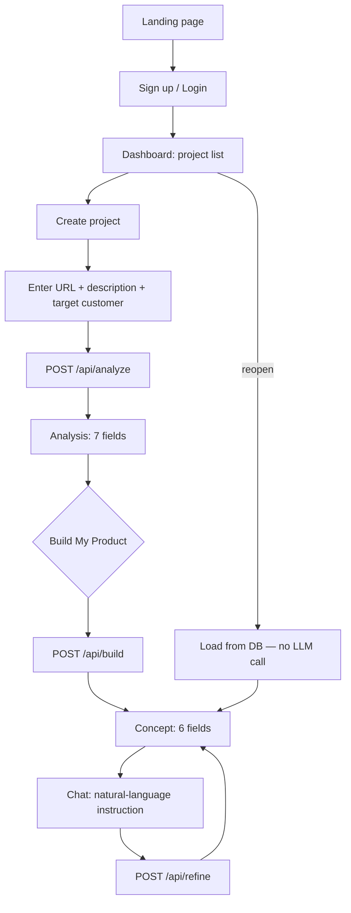

# 04 — Execution Flows

How the seven required capabilities compose at runtime. Flows marked **[OUR DECISION]** are our implementation of a requirement the PDF states only as an outcome.

## The core product loop



The `M` branch is load-bearing twice over: it satisfies "reopen previous projects" (requirement 6) **and** the cost rule that reopening never re-calls Gemini.

## The three-call AI pipeline **[OUR DECISION]**

The PDF describes outcomes; we implement them as three chained server-side calls, each returning strict JSON parsed into a typed, zod-validated object.

| Step | Route | Input | Output | Cached |
|---|---|---|---|---|
| **Analyzer** | `POST /api/analyze` | url, description, targetCustomer | analysis object (7 fields) | yes, by projectId |
| **Builder** | `POST /api/build` | projectId (reads cached analysis) | concept object (6 fields) | yes, by projectId |
| **Editor** | `POST /api/refine` | projectId + instruction | **full** updated concept | yes, overwrites concept |

Design rules:

- **Analyzer** fetches the target site's text server-side first, then prompts. Never ask the model to "visit" a URL — it can't. Fetch, strip to text, truncate to a token budget, then prompt.
- **Builder** consumes the *cached analysis*, not the raw site. One dependency hop, so a re-build is cheap and deterministic-ish.
- **Editor** is **idempotent and returns the whole concept object**, not a patch. Simpler to persist, simpler to render, and it makes "undo" a matter of keeping the previous row.

Each call sets `maxOutputTokens` and validates its response with zod before anything touches the DB or the UI.

## Analyzer flow in detail

```
url + description + targetCustomer
  → validate input (zod)
  → fetch(url) server-side, timeout + size cap
  → strip HTML to text, truncate to budget
  → [bonus] microlink screenshot → pass image to vision model
  → prompt Analyzer with site text + user's description + target customer
  → parse JSON → zod validate
  → persist to projects table
  → return typed analysis
```

Failure modes to handle explicitly — the grader **will** paste a hostile URL:

| Failure | Handling |
|---|---|
| URL unreachable / times out | Typed error, friendly message, don't persist |
| Site is a JS-only shell with no text | Fall back to meta tags + title; tell the user the site was thin |
| Page is enormous | Truncate before prompting, never send the whole DOM |
| Model returns malformed JSON | zod fails → one retry with a stricter instruction → then typed error |
| 429 rate limit | "Rate limited, retrying" state + backoff, never a crash |

## Refine (chat) flow

```
user types instruction → debounce → serialize (one in-flight request max)
  → POST /api/refine { projectId, instruction }
  → load current concept from DB
  → prompt Editor with (current concept + instruction)
  → zod validate full concept
  → persist, return, re-render
```

The serialization matters: the free tier is ~10–15 RPM and a chat box invites rapid-fire input. Queue or block, don't fan out.

Demo script — the four verbatim instructions from the PDF, in order:

1. "Make the design more premium."
2. "Add a dashboard."
3. "Remove the pricing page."
4. "Make it suitable for enterprise customers."

These should each visibly change the rendered concept. Test all four before recording.

## Auth & route protection

```
Public:    /                     (landing)
           /login  /signup
Protected: /dashboard            (project list)
           /dashboard/[projectId] (analysis + concept + chat)
```

- Middleware guards `/dashboard/*`; unauthenticated → `/login`.
- RLS on every table so a user can only read their own projects — belt and braces with the middleware. RLS is what actually enforces it; middleware is UX.
- Logout must be reachable from the dashboard chrome (it's a graded bullet).

## State on every async view

The PDF grades "production readiness". Every view that awaits something needs all four:

- **loading** — skeleton, not a spinner-on-white
- **error** — the typed message from the route, with a retry
- **empty** — "no projects yet" with a CTA to create one
- **rate-limited** — distinct from generic error, says it's retrying

## Deploy flow

```
pnpm lint && pnpm build          # both green, locally
  → push to GitHub
  → Vercel preview deploy
  → set env vars in Vercel (all of .env.example)
  → smoke-test the preview URL in a fresh incognito window as a NEW user
  → promote to production
```

Smoke-testing as a new user in incognito is non-negotiable — it's exactly what the grader does, and it's the only way to catch a broken sign-up flow or a missing env var.
