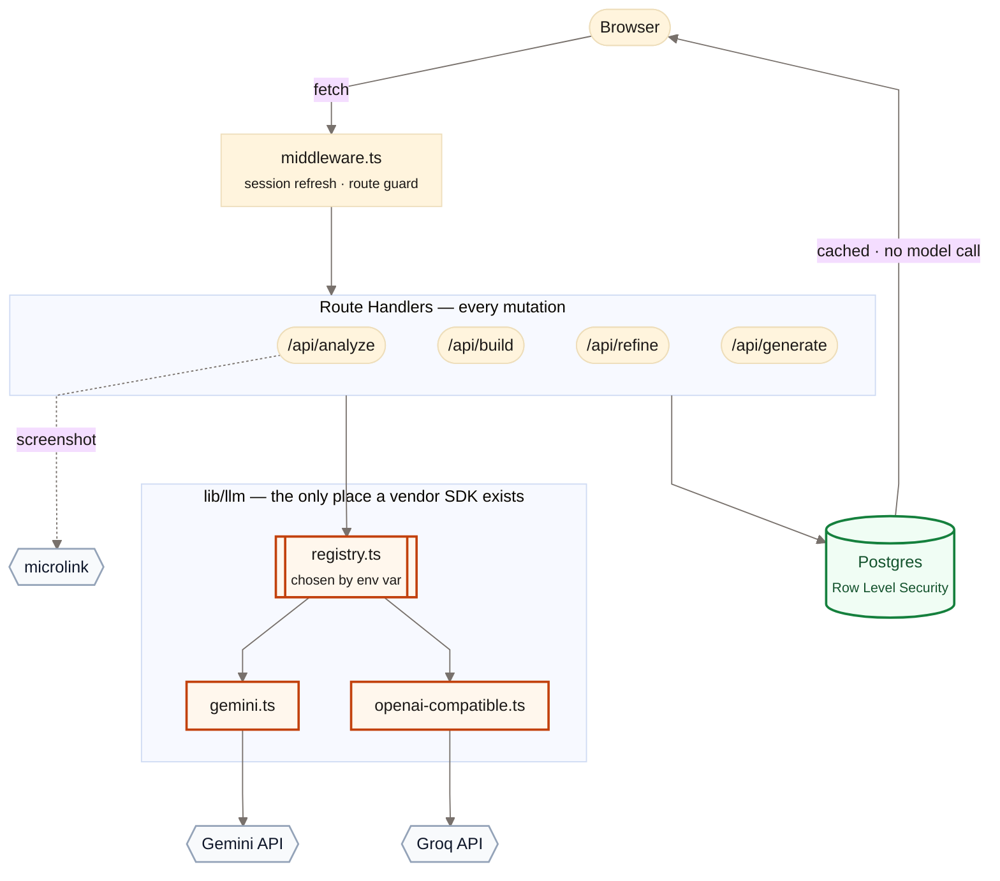
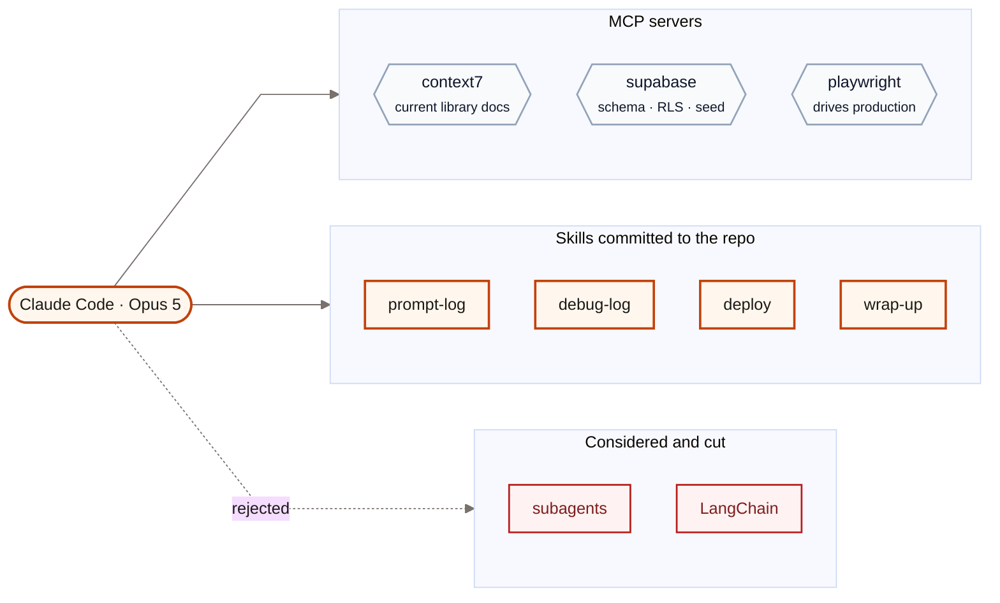
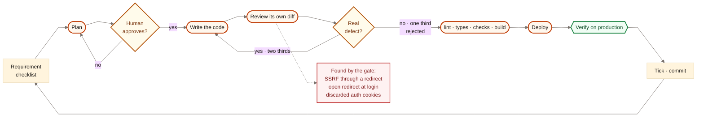
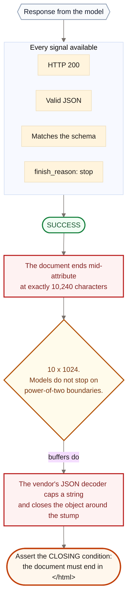
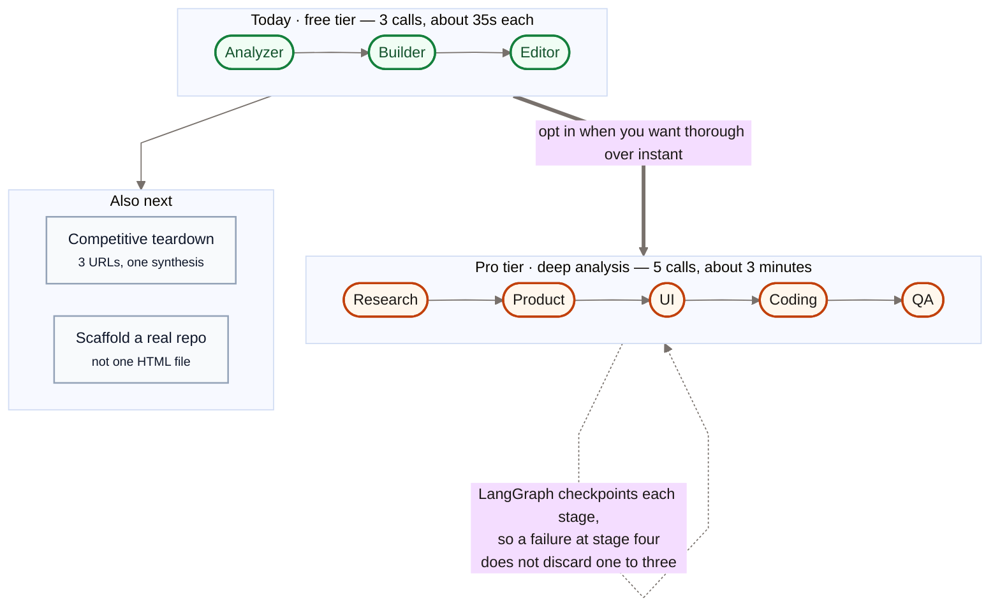

# Diagrams — Mermaid source

The canonical diagrams for this project. The same blocks appear in `README.md`,
`docs/01` and `docs/02`; this file is where they are edited and where the shared
style lives.

Paste any block into **https://mermaid.live**, then export PNG at 2x for the
video. GitHub renders them in place.

**Do not screen-record a markdown file for the video.** Scrolled text is
unreadable at video speed, and the viewer spends the beat squinting instead of
listening. A still diagram is legible in one glance.

---

## The shared style

Every diagram opens with the same `init` block, so they read as one system:

- `curve: 'linear'` — **straight lines, no bezier curves.** This is the single
  biggest change; the default curves make a technical diagram look hand-waved.
- Shapes carry meaning, and are used consistently:

| Shape | Syntax | Means |
|---|---|---|
| Rounded | `([text])` | A process or a step |
| Rectangle | `[text]` | A component or a file |
| Cylinder | `[(text)]` | A datastore |
| Diamond | `{text}` | A decision |
| Hexagon | `{{text}}` | An external service |
| Doubled | `[[text]]` | A subsystem with internals |

- Four colour classes, matched to the app's ember accent: `core` (ours),
  `data` (persistence), `ext` (someone else's), `gate` (a decision), `bad`
  (a failure), `good` (a verified state).

---

## 1 · Architecture

Video beat 3 · also in `README.md`.

---

## 2 · AI tools used

Video beat 4 · also in `docs/02`.

---

## 3 · How Claude Code was used

Video beat 5 · also in `docs/01` and `docs/02`.

---

## 4 · The debugging example

Video beat 6 · also in `docs/04`, entry 10.

---

## 5 · What comes next

Video beat 7 · also in `README.md`.

---

## Rendering for the video

- **2x export.** A 1x PNG looks soft at 1080p.
- **One diagram per beat, held still.** No build-on animation — the voice does
  the sequencing, and a diagram that assembles itself competes with it.
- **Check the smallest label on a phone** before committing to a render. If it
  is unreadable there, cut the label rather than shrinking the diagram.
