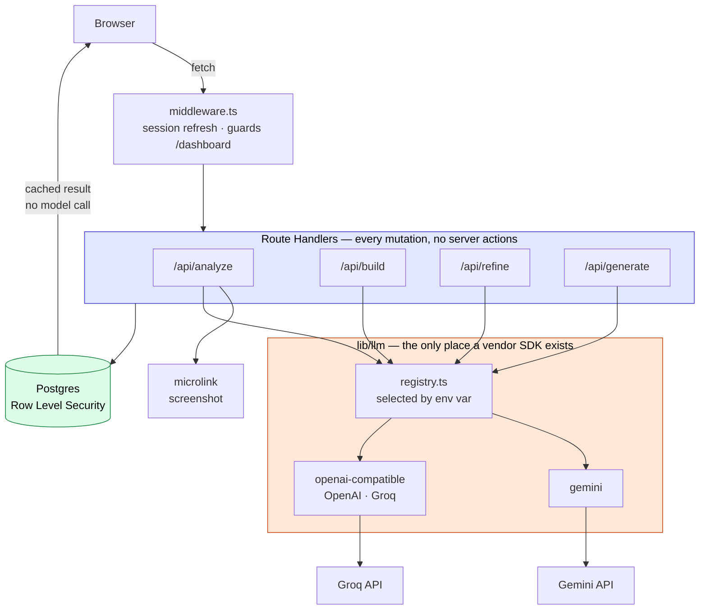
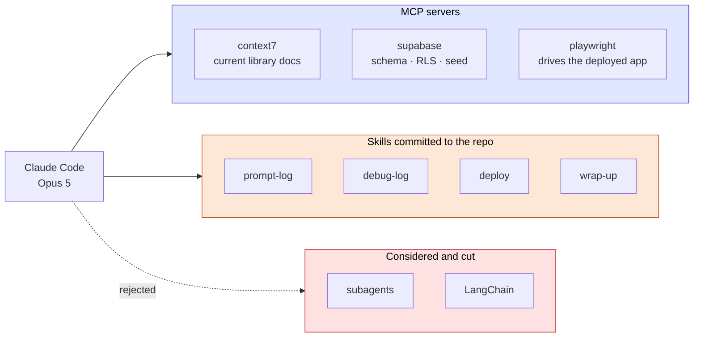
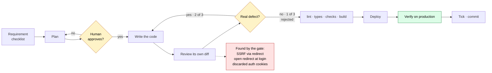
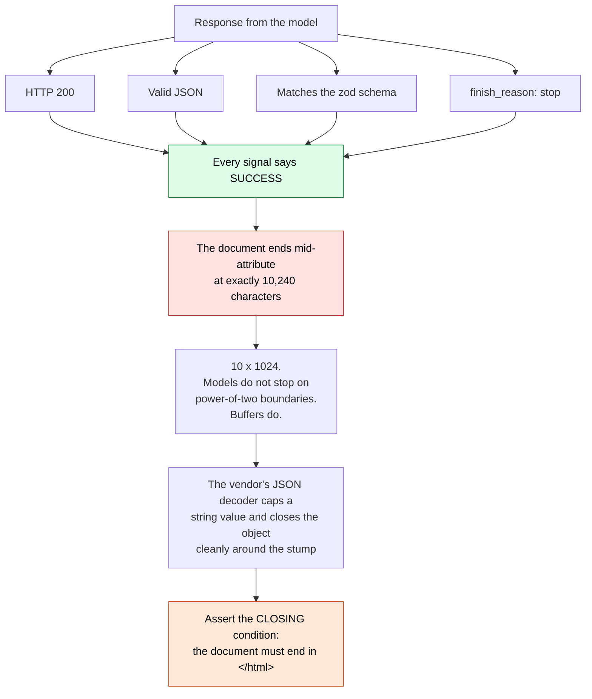
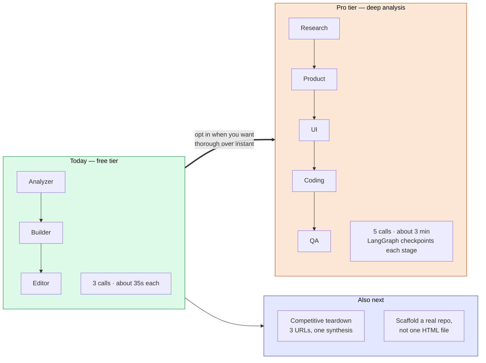

# Video diagrams — Mermaid source

Five diagrams, one per narrated beat. Paste each block into
**https://mermaid.live**, then export PNG at 2x and drop it on the timeline.

**Do not screen-record the repo for these.** Scrolling a markdown file is the
weakest visual available: the text is too small to read at video speed, and the
viewer spends the whole beat trying to read instead of listening. A single
diagram that stays still for twenty seconds reads instantly.

Diagrams 1 and 2 already exist in `README.md` and `docs/01`. They are repeated
here so every asset for the video is in one place, and so you can render them
without the surrounding page.

Colours match the app's ember accent, so the slides and the product look like
one thing.

---

## Beat 3 — Architecture (1:07–1:31)

**Say this over it:** the key is `lib/llm` sitting between features and vendors,
and RLS sitting under everything.

---

## Beat 4 — AI tools used (1:31–1:50)

---

## Beat 5 — How Claude Code was used (1:50–2:20)

---

## Beat 6 — The debugging example (2:20–2:40)

Entry 10: the generated page that passed every check and was broken.

**The beat lands on the last box.** For anything a model generates in one pass,
every other signal will tell you it worked.

---

## Beat 7 — What comes next (2:40–2:58)

**Why this is the closing image.** It shows the cut was a tier boundary rather
than a dead end, it gives the latency number that justifies it, and it names two
features that extend what already works instead of inventing a new product.

---

## Rendering notes

- **2x export.** A 1x PNG looks soft at 1080p.
- **Light background.** The slides sit between screen-recorded segments of a
  dark app; alternating keeps the beats visually separate.
- **One diagram per beat, held still.** No build-on animation. The voice is
  doing the sequencing, and a diagram that assembles itself competes with it.
- **Check the smallest text on a phone** before you commit to a render. If a
  label is unreadable there, cut the label rather than shrinking the diagram.
