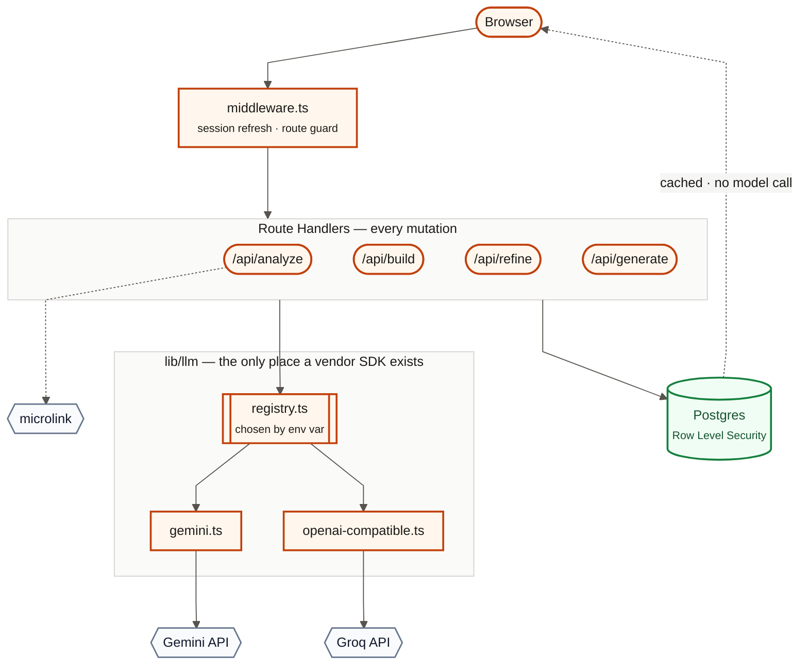
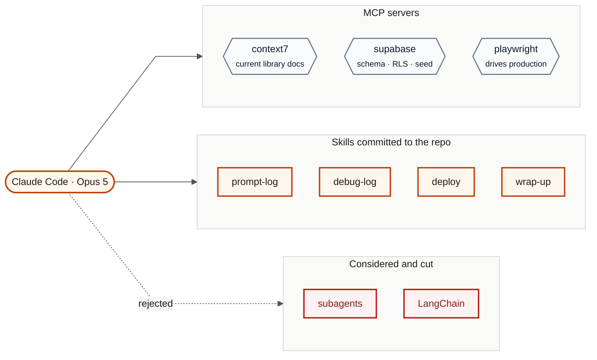
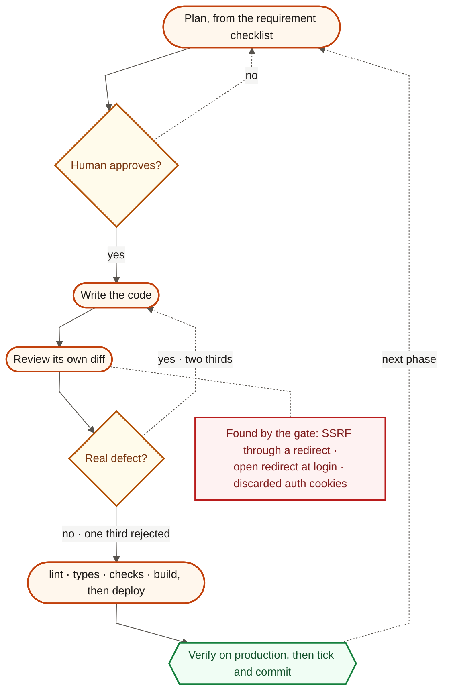
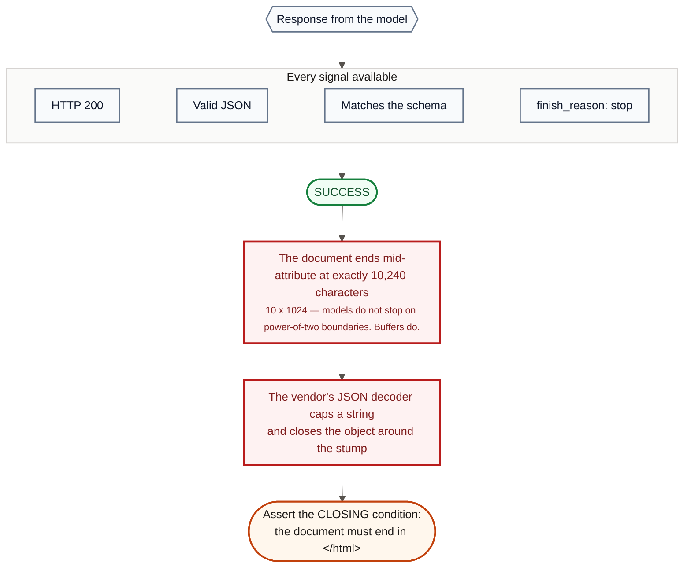
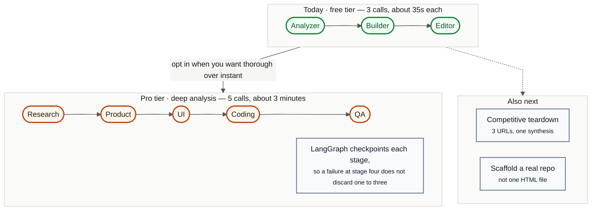

# Diagrams — Mermaid source

The canonical diagrams for this project. The same blocks appear in `README.md`,
`docs/01` and `docs/02`; this file is where they are edited and where the shared
style lives.

Paste any block into **https://mermaid.live**, then export PNG at 2x for the
video. GitHub renders them in place.

**Do not screen-record a markdown file for the video.** Scrolled text is
unreadable at video speed, and the viewer spends the beat squinting instead of
listening. A still diagram is legible in one glance.

---

## The shared style

Every diagram opens with the same `init` block, so they read as one system and
render identically for every viewer.

### Every theme variable is pinned

This is not decoration. GitHub renders a README in the viewer's theme, and a
diagram that sets only *some* colours inherits the rest — so cluster
backgrounds, subgraph titles and edge labels came out dark-on-dark for anyone
using dark mode, while the nodes stayed light. The fix is to pin all of them:
text, lines, node fills, `clusterBkg`, `clusterBorder`, `edgeLabelBackground`
and `titleColor`.

The diagrams therefore render as light cards in both themes, which is the same
behaviour an exported image would have.

### Line types mean something

Three edge styles, used the same way everywhere:

| Edge | Syntax | Means |
|---|---|---|
| Solid | `-->` | The normal path. What happens by default |
| Dotted | `-.->` | Optional, conditional, rejected, or a side effect |
| Label | `-->\|"text"\|` | Names the condition on the edge |

Thick edges (`==>`) are **not** used. They read as a fourth meaning that no
diagram here needs, and they were the main source of the inconsistency.

### Shapes carry meaning

| Shape | Syntax | Means |
|---|---|---|
| Rounded | `([text])` | A process or a step |
| Rectangle | `[text]` | A component or a file |
| Cylinder | `[(text)]` | A datastore |
| Diamond | `{text}` | A decision |
| Hexagon | `{{text}}` | An external service, or a verification |
| Doubled | `[[text]]` | A subsystem with internals |

### Six colour classes

`core` (ours) · `data` (persistence) · `ext` (someone else's) · `gate` (a
decision) · `bad` (a failure) · `good` (a verified state). All are keyed to the
app's ember accent so the slides and the product look like one thing.

---

## 1 · Architecture

Video beat 3 · also in `README.md`.

---

## 2 · AI tools used

Video beat 4 · also in `docs/02`.

---

## 3 · How Claude Code was used

Video beat 5 · also in `docs/01` and `docs/02`.

---

## 4 · The debugging example

Video beat 6 · also in `docs/04`, entry 10.

---

## 5 · What comes next

Video beat 7 · also in `README.md`.

---

## Rendering for the video

- **2x export.** A 1x PNG looks soft at 1080p.
- **One diagram per beat, held still.** No build-on animation — the voice does
  the sequencing, and a diagram that assembles itself competes with it.
- **Check the smallest label on a phone** before committing to a render. If it
  is unreadable there, cut the label rather than shrinking the diagram.
